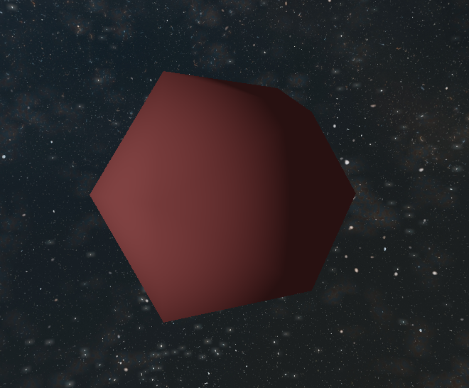
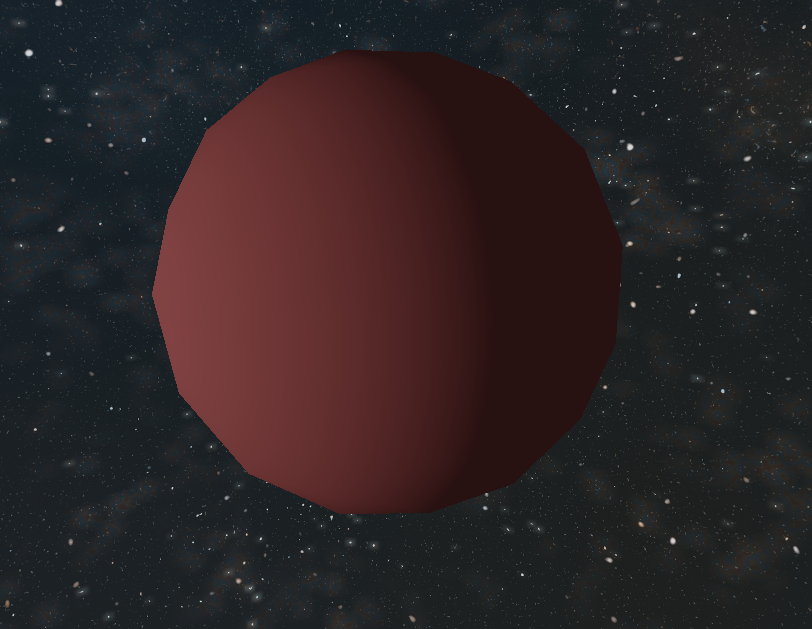
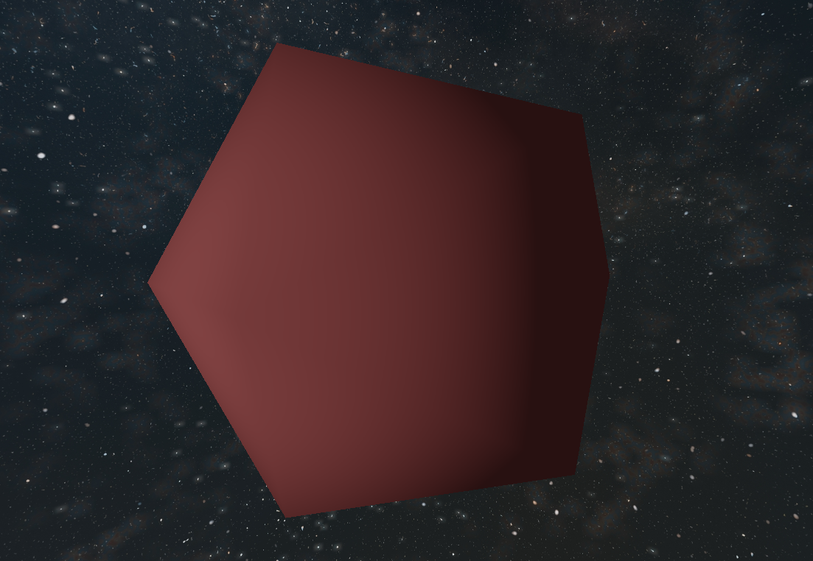
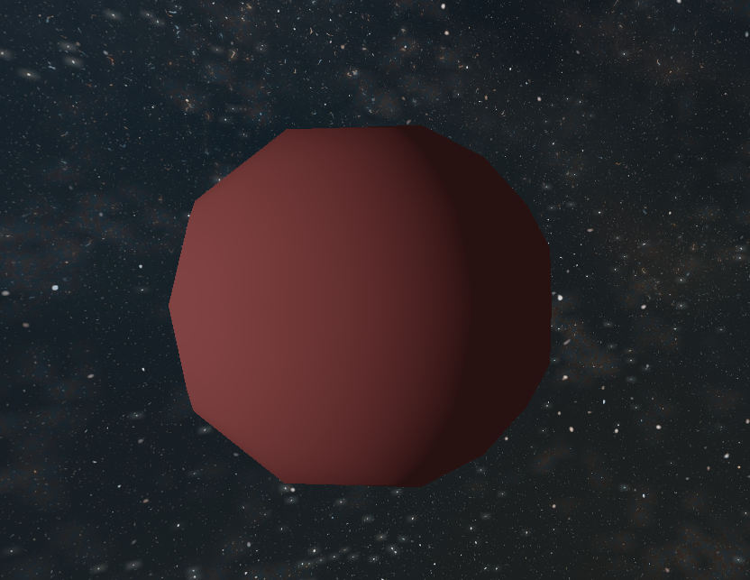
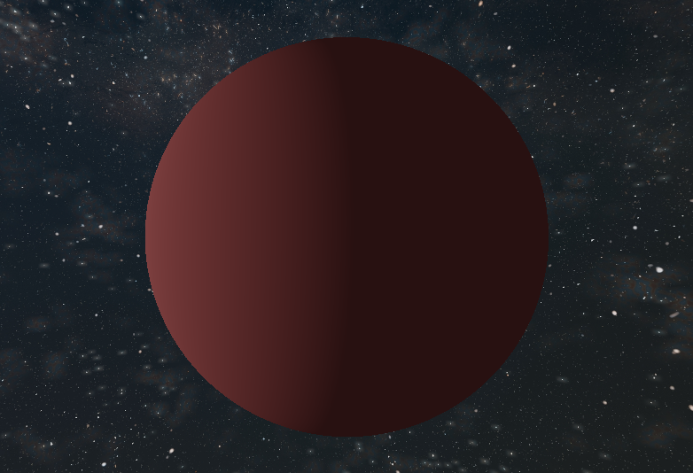
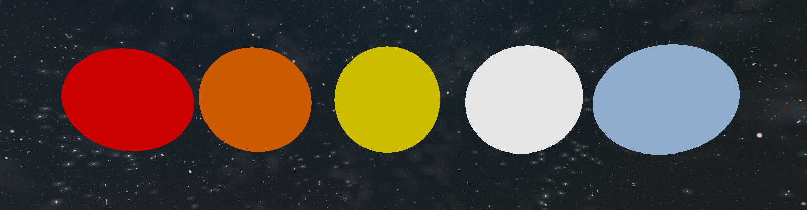
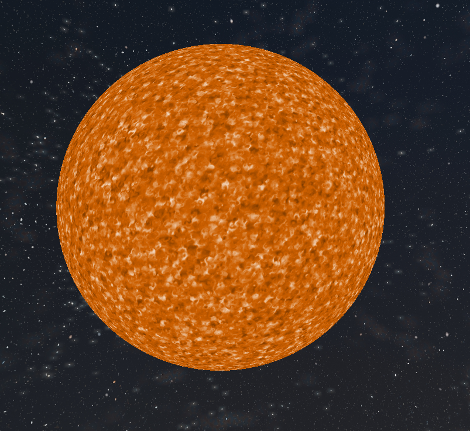

# Report Assignment 2 3DCGM
07/11/2025

Vlad Tudor Stefanescu - 5465877

Alexandru - Cristian Dumitrache - 5487773

## Introduction
This report presents the features and implementation details of the 3D Computer Graphics and Modelling (3DCGM) assignment 2. The project focuses on creating a 3D scene conainting a solar system and a spaceship that can navigate through it.

## Features Implemented
Before diving in, our project uses a toml config file which can be chosen before running the project. We have multiple of these files which are used for different things inside the configurations folder. Configurable parameters in the toml are written like this `toml:param_category.param_name`. ImGUI configurable parameter names are written like this `imgui:param_name`.

### Solar System
**Celestial Bodies**

The celestial bodies in our system use a runtime generated mesh of a class I geodesic icosahedron [https://en.wikipedia.org/wiki/Geodesic_polyhedron#Class_I].

This mesh is generated with a frequency (`toml:planets.ico_mesh_resolution`) and then used to render all celestial bodies in our project. The difference made by using a geodesic icosahedron instead of a regular icosahedron is in Figure 1 below.

| Regular Icosahedron          | Geodesic Icosahedron         |
|:-------------------:|:-------------------:|
| `geodesic_resolution_1.toml` | `geodesic_resolution_3.toml` |
|  |  |

*Figure 1: Comparison between a regular icosahedron and a class I geodesic icosahedron mesh with frequency 3 used for celestial bodies.*

We implement 4 types of celestial bodies (some of which we will go into more depth below):
- Default body (This is the parent class of all other body types and implements default behaviour. It is used as a placeholder for moons.)
- Star
- Earth
- Null body (not rendered, but used for orbital anchoring)

Default bodies also have basic attributes like position, color(`imgui:Fallback Color`, `toml:planets.fallback_color`), ka(`toml:planets.fallback_ka`), kd(`toml:planets.fallback_kd`), and radius. The radius can also be configured using imgui, or toml (we explain this below). n.b. The color, ka, and kd are not used if the body is a child class of default body.

**Tesselation**

All Cellestial bodies implement adaptive tesselation to improve the resolution of the geodesic icosahedron mesh.

This can be toggled(`imgui:Body Tesselation`, `toml:planets.enable_body_tesellation`), and can be made to adjust the height of triangles in pixels(`imgui:Target Body Tessellation Triangle Height`, `toml:target_triangle_height`).

The reason for adding gpu side tessellation alongside cpu side tesselation (the geodesic icosahedron) is because it is dynamic. However, the increase of resolution that can be achieved in opengl with tesselation is limited, so we still need cpu side tessellation. Another reason for using both is that with CPU tesselation we have more control over how triangles are split, resulting in a better distribution.

An alternative to this method would be to use a high triangle count mesh of a sphere but because of the way we implemented terrain (see below Earth section), tessellation is better suited to our needs.

Below is a table comparing (on a geodesic with frequency 1) tesselation off, tesselation with target triangle hegiht 100, and tesselation with target triangle height 1.

| Tessellation Off | Triangle Height 100 | Triangle Height 1 |
|:----------------:|:-------------------:|:-----------------:|
| `tessellation_off.toml` | `tessellation_on_100.toml` | `tessellation_on_1.toml` |
|  |  |  |

*Figure 2: Comparison of tessellation settings on a geodesic icosahedron mesh with frequency 1.*

The tesselation evaluation step is basic, it just outputs worldspace position, normalized position on the sphere (i.e. model space position), and the clip space position. However, the earth implements a more advanced tesselation evaluation, which will be explained in the Earth section.

**Stars**

Stars implement color using temperature. This is configurable as a global default(`toml:planets.star.default_star_temperature`) and on a per star basis(`imgui:Temperature (C)`). Cold stars are red and the hottest are light blue. This temperature factor also impacts their light intensity.

*Figure 3: Star color comparison based on temperature in Celsius, from left to right 3000, 4500, 5778 (Sun), 10000 and 30000.* 

**Stars: Animated textures**
Stars also implement animated textures(`toml:planets.star.enable_star_texture`, `imgui: Enable Star Texture / Animation`). These textures are implemented using 4d noise in the fragment shader. The base opensimplex noise is taken from https://github.com/stegu/webgl-noise. Using this I implemented a fractal noise algorithm,  
which is used in conjunction with domain warping to get swirls. this value is then used to interpolate colors (based on temperature) to get a nice looking star.
The 4 dimensions are needed because I am sampling the noise at the fragPosition(3D) at the point in time t, our 4th dimension. Parameters for the noise function can be configured(`toml:planets.star`).

*Figure 4: Star with animated textures enabled. To see the effect run the project, or look at the demo.*

**Hierarchical transformations**
The solar system is composed of spherical bodies of several types:

### Spaceship

### Lighting and Shading
**Eclipses**

**Star lights (shadow mapping)**

**???**

### Skybox

### MiniMap?

### Cameras?

[//]: # (Part Dumi)

## 1. Battlecruiser

- AutoCad Model
- Model fed into AutoCad to scale, set the origin position, and apply PBR textures
- PBR textures with smart UV wrapping
- Export model with materials (panels)
- PBR based shading (diffuse model based on ..., specular model based on ...)

### 1.1 Modelling
### 1.2 Texturing and Scaling
### 1.3 PBR Shading
### 1.4 Shadow Mapping and Eclipse Ray-Tracing
### 1.5 Environment Mapping Skybox
### 1.6 Particles
### 1.7 Light Particles
### 1.8 Free Movement
### 1.9 Bezier Constant Path Movement

## 2. Cameras
### 2.1 Free Camera
### 2.2 Camera Following Battlecruiser
### 2.3 Minimap

## 3. Skybox

