# Report Assignment 2 3DCGM
07/11/2025

Vlad Tudor Stefanescu - 5465877

Alexandru - Cristian Dumitrache - 5487773

# 1. Contributions

All planet related -> Vlad

Battlecruiser related -> Alex

Shadows and eclipses and light combination -> Vlad

Skybox and cameras / minimap -> Alex

Thruster light contribution -> Alex

Bezier Path -> Alex

# 2. Table of contents
- [1. Contributions](#1-contributions)
- [2. Table of contents](#2-table-of-contents)
- [3. Introduction](#3-introduction)
- [4. Battlecruiser](#4-battlecruiser)
    - [4.1 Modelling](#41-modelling)
    - [4.2 Texturing and Scaling](#42-texturing-and-scaling)
    - [4.3 OpenGl loading](#43-opengl-loading)
    - [4.4 PBR Shading](#44-pbr-shading)
    - [4.5 Shadow Mapping and Eclipse Ray-Tracing](#45-shadow-mapping-and-eclipse-ray-tracing-explained-in-section-6)
    - [4.6 Environment Mapping Skybox](#46-environment-mapping-skybox)
    - [4.7 Particles](#47-particles)
    - [4.8 Light Particles](#48-light-particles)
    - [4.9 Movement](#49-movement)
- [5. Solar System](#5-solar-system)
    - [5.1 Celestial Bodies](#51-celestial-bodies)
    - [5.2 Tessellation](#52-tessellation)
    - [5.3 Stars](#53-stars)
    - [5.4 Stars: Animated textures](#54-stars-animated-textures)
    - [5.5 Earth Terrain](#55-earth-terrain)
    - [5.6 Earth Surface Normals](#56-earth-surface-normals)
    - [5.7 Earth Water](#57-earth-water)
    - [5.8 Hierarchical transformations](#58-hierarchical-transformations)
- [6. Lighting and Shading](#6-lighting-and-shading)
    - [6.1 Eclipses](#61-eclipses)
    - [6.2 Star lights (shadow mapping)](#62-star-lights-shadow-mapping)
    - [6.3 Cellestial Body Shading](#63-cellestial-body-shading)
    - [6.4 Light Combination Battlecruiser](#64-light-combination-battlecruiser)
    - [6.5 Light Combination / tone mapping Celestial Bodies](#65-light-combination--tone-mapping-celestial-bodies)
    - [6.6 PBR Shaders](#66-pbr-shaders-explained-in-section-44)
- [7. Cameras](#7-cameras)
    - [7.1 Free Camera](#71-free-camera)
    - [7.2 Camera Following Battlecruiser](#72-camera-following-battlecruiser)
    - [7.3 Minimap](#73-minimap)
- [8. Skybox](#8-skybox)
    - [8.1 Overview and Responsibilities](#81-overview-and-responsibilities)
    - [8.2 Cubemap Loading](#82-cubemap-loading)
    - [8.3 Rendering](#83-rendering)
    - [8.4 Shader Overview](#84-shader-overview)
- [9. Conclusion](#9-conclusion)

# 3. Introduction
This report presents the features and implementation details of the 3D Computer Graphics and Modelling (3DCGM) assignment 2. The project focuses on creating a 3D scene conainting a solar system and a spaceship that can navigate through it.

Before diving in, our project uses a toml config file which can be chosen before running the project. We have multiple of these files which are used for different things inside the configurations folder. Configurable parameters in the toml are written like this `toml:param_category.param_name`. ImGUI configurable parameter names are written like this `imgui:param_name`. The config file can be provided as a command line argument, if you do not have a beefy gpu, we recommend you run the project with the `configurations/simple.toml` configuration file. Other interesting configuration files in the folder are `default.toml`, `demo.toml`, and `binary.toml`.

# 4. Battlecruiser

The battlecruiser represents the central 3D model of our project and serves as both a visual and technical showcase for advanced rendering, lighting, and animation techniques within OpenGL.
Inspired by the Terran Battlecruiser from StarCraft II, the ship was designed and implemented through a complete asset pipeline, beginning with CAD-based modelling, PBR texturing, OpenGL integration, and ending with physically based shading, shadow mapping, particle effects, and motion systems.

This section details every stage of the battlecruiser's development, including:
- Modelling and Asset Creation: mechanical design using Autodesk Fusion360 and Blender for texturing and UV mapping.
- PBR Shading and Rendering: implementation of a physically based rendering system with realistic material behavior.
- Lighting and Reflection Systems: environment-mapped reflections, emissive thruster lighting, and eclipse-aware illumination.
- Particle and Thruster Effects: dynamic exhaust effects using GPU-instanced particle systems.
- Movement and Animation: dual-mode flight system supporting both user-controlled and Bezier-path navigation.

Together, these components form the technical foundation of the battlecruiser module, uniting CAD precision, shader programming, and real-time rendering techniques into a cohesive visual centerpiece for the project.

## 4.1 Modelling

The battlecruiser model developed for this project was inspired by the Terran Battlecruiser from the well-known and nostalgic game StarCraft II (see Figure 1 and Figure 2). While the original model is characterized by an abundance of intricate surface details, mechanical panels, and complex geometry, this project aimed for a simplified version that retains the essential silhouette and design features without excessive geometric complexity. This approach facilitates easier implementation of physically-based rendering (PBR) shaders later in the pipeline and allows the fine surface details to be expressed primarily through texture maps (e.g., normal, metallic, and roughness maps) rather than raw mesh geometry.

<figure>
  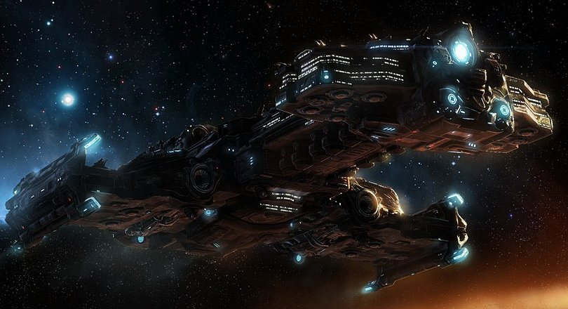
  <figcaption style="text-align:center;">Figure 1. Terran Battlecruiser from Starcraft 2 (rendered).</figcaption>
</figure>

<figure>
  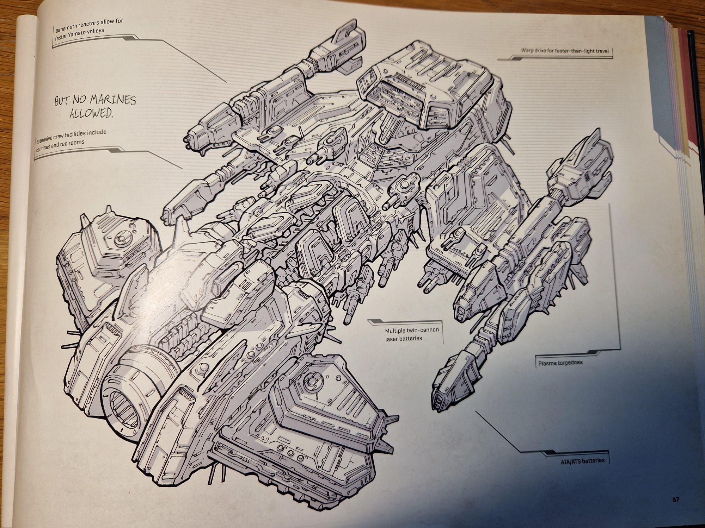
  <figcaption style="text-align:center;">Figure 2. Terran Battlecruiser from Starcraft 2 (schematic).</figcaption>
</figure>

## 4.1.1 Software Selection and Rationale

For the modelling stage, Autodesk Fusion360 was chosen over Blender.
While both tools are highly capable, they target different design philosophies:

| **Aspect**                | **Fusion360**                                                  | **Blender**                                       |
|---------------------------|----------------------------------------------------------------|---------------------------------------------------|
| **Primary Purpose**       | Engineering, product design, and mechanical CAD                | Artistic modelling, animation, and rendering      |
| **Model Representation**  | Parametric / solid and surface modelling                       | Polygonal / mesh-based modelling                  |
| **Precision**             | High – dimension-driven constraints ensure mechanical accuracy | Lower – relies on artistic approximation          |
| **Ease of UV Unwrapping** | Limited – not primarily intended for texturing                 | Excellent – designed for texture and UV workflows |

There are several advantages of using Fusion360 for modelling:
- Parametric design allows for exact control of dimensions and relationships between parts.
- Easy to modify and update components without rebuilding the entire model.
- Ideal for mechanical objects (like the battlecruiser), where alignment, scale, and precision are important.
- Supports solid body modeling, making it easier to design functional or symmetrical assemblies.

But it also comes with some disadvantages for pure modelling and transitioning to an OpenGL project:
- Limited support for UV mapping and texturing, requiring a separate workflow in Blender.
- Export process can occasionally introduce issues (non-triangulated meshes, high vertex counts).
- Less intuitive for artists or those focusing on aesthetic surface detail and visual polish.

In contrast, Blender excels in artistic modeling, sculpting, and texture workflows. However, because this stage emphasized mechanical structure and precision, Fusion360 was a more suitable choice. Blender was later used to handle UV unwrapping, material setup, and PBR texturing (see Section 1.2).

## 4.1.2 Modelling Process

The modelling workflow followed a modular assembly approach, dividing the battlecruiser into several key components:
- Bridge: The command and control structure of the ship, including the antenna mount.
- Body: The central fuselage, containing the thruster housing and core structure.
- Thrusters: Cylindrical engines placed symmetrically at the rear for propulsion visuals.
- Front Wings: Forward-facing stabilizers defining the ship's aerodynamic shape.
- Main Wings: Larger structures providing balance and visual weight to the rear body.
- Armament: A simple double-barrel cannon modeled separately and attached to the main body.
- Antenna: Custom mechanical component placed atop the bridge for detail and realism.

Each component was modeled as a separate body, then combined into an assembly using Fusion360's hierarchical design tree. This modular structure simplifies both scaling and part replacement later in the pipeline.

The resulting model (see Figure 3) preserves the recognizable silhouette of the StarCraft battlecruiser while remaining lightweight enough for efficient real-time rendering in OpenGL.

<figure>
  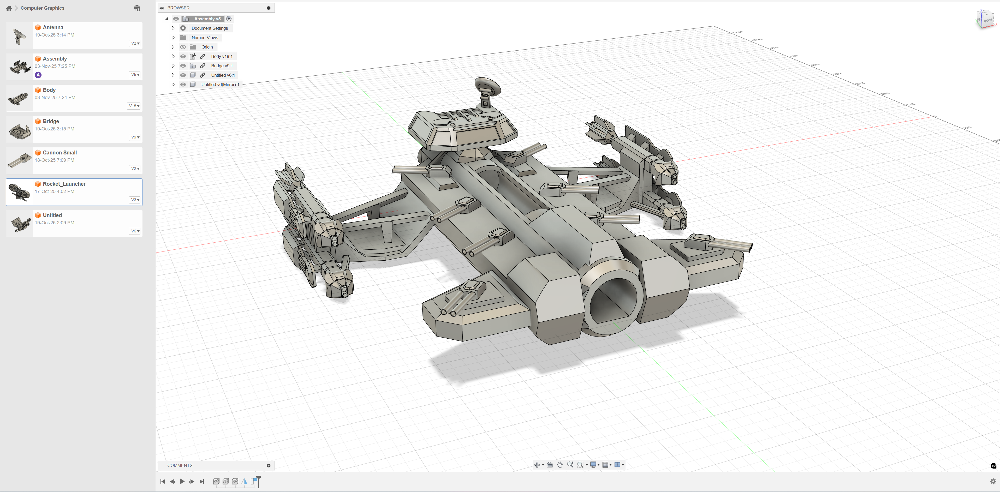
  <figcaption style="text-align:center;">Figure 3. Battlecruiser Assembly Model.</figcaption>
</figure>

## 4.2 Texturing and Scaling

Once the battlecruiser model was finalized in Fusion360, it was exported as an `.OBJ` file and imported into Blender for texturing and UV preparation. Blender served as the primary environment for applying Physically Based Rendering (PBR) textures, adjusting scale, and preparing the mesh for integration into the OpenGL pipeline.

### 4.2.1 Import and Scaling

Upon import, Blender provided the option to optimize mesh density by reducing the number of vertices. However, in this case, the geometry was already well-balanced between visual fidelity and performance, so no simplification was necessary.

The first major step was to scale the model to a suitable size for the existing OpenGL scene. The battlecruiser's proportions were adjusted to match the approximate size of the planetary objects already implemented in the project.
This ensures visual consistency and prevents rendering or lighting artifacts due to extreme size mismatches.

Additionally, the origin position of the model was reset and centered at the geometric midpoint of the mesh. This adjustment is essential for realistic motion behavior, as future transformations, such as rotation and translation (see Sections 1.8 and 1.9), will depend on the correct pivot point. A misaligned origin would otherwise result in unnatural rotation or scaling effects in OpenGL.

### 4.2.2 PBR Texturing Workflow

After scaling and positioning, the next step was to introduce PBR (Physically Based Rendering) textures to the model. Initially, the imported geometry appeared plain and featureless; PBR texturing provides the necessary visual richness by simulating realistic material properties such as light reflection, surface roughness, and metallicity.

Each material in a PBR workflow is typically composed of multiple texture maps, each defining a specific physical property:

| **Map Type**      | **Description**                                      | **Purpose in Rendering**                                                                              |
|-------------------|------------------------------------------------------|-------------------------------------------------------------------------------------------------------|
| **Albedo Map**    | Base color texture (no lighting information).        | Defines the diffuse color and overall appearance of the surface.                                      |
| **Normal Map**    | Encodes fine surface detail through RGB vectors.     | Simulates geometric surface variations (bumps, panels, scratches) without increasing mesh complexity. |
| **Roughness Map** | Controls the diffusion of reflected light.           | Determines how glossy or matte the surface appears; lower values yield sharper reflections.           |
| **Metallic Map**  | Defines metallic versus dielectric surface behavior. | Controls how light reflects from metallic surfaces compared to non-metallic ones.                     |

Blender's Shader Editor was used to assign these textures via the Principled BSDF node (Figure 4), which is based on the same Cook–Torrance microfacet model employed by modern PBR engines. This setup provided a near-identical preview to what would later be reproduced in the custom OpenGL shader implementation (discussed in Section 1.3).

<figure>
  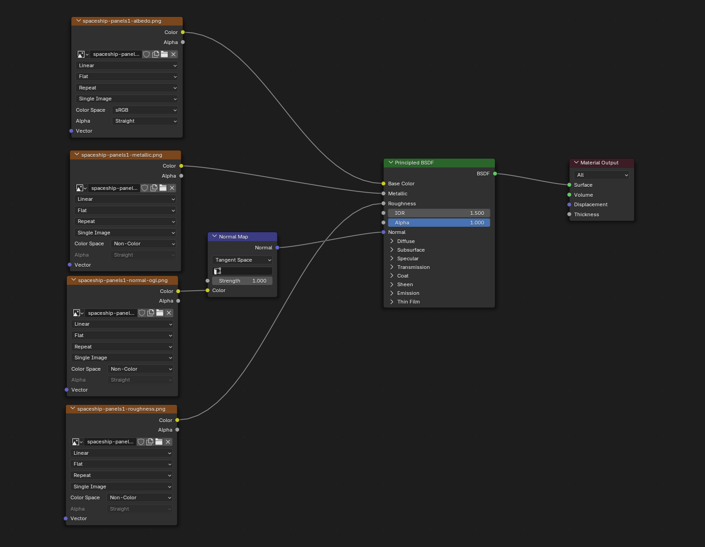
  <figcaption style="text-align:center;">Figure 4. Blender Shader Node for a material with PBR textures.</figcaption>
</figure>  

### 4.2.3 Material Assignment

To achieve a balanced visual composition, distinct materials were created and assigned to different structural parts of the battlecruiser. Each major component received its own PBR texture set or material definition to help convey functional and visual differentiation:

- Body and Wings: A medium-metallic, dark-gray texture emphasizing surface panels and mechanical wear.
- Body Center: A lighter and lower-metallic texture compared to the wings and the rest of the body, distinguishing the main weaponry component from the supporting structure.
- Bridge: The same base texture as the body, to maintain visual coherence and material uniformity.
- Cannons: A lighter, brushed-metal texture that contrasts with the darker hull materials, providing visual emphasis on the weapon systems.
- Antenna and Bridge Details: Fully metallic texture chosen for its polished, high-reflectivity finish, suitable for representing conductive mechanical parts.
- Thrusters: Specialized emissive textures simulating heat and glow, which will later be complemented by dynamic particle effects (see Section 1.7).
- Bridge Windows: Assigned a dedicated window material, but without any applied texture maps at this stage. The material serves as a placeholder to be replaced with an environment-mapped reflective surface during the implementation of the skybox and reflection pipeline (see Section 1.5).

This modular texturing ensured visual variety while maintaining material consistency across related ship components. Furthermore, predefining the window material at this stage allows for a more seamless integration of environmental reflections later in the OpenGL rendering pipeline.

### 4.2.4 UV Unwrapping and Texture Mapping

Before exporting the model for OpenGL, UV unwrapping was performed.
UV unwrapping is the process of projecting the 3D surface of the model onto a 2D plane, creating a UV map that defines how texture pixels correspond to surface coordinates.

Blender's Smart UV Project method was employed to automatically generate efficient UV layouts for each component. This technique minimizes visible seams and ensures optimal texture space utilization. In some cases, manual adjustments were made to improve alignment on visible surfaces such as the wings and body panels.  

Texture scaling and tiling were also adjusted to prevent distortion and to ensure consistent texel density across all parts of the model. These texture coordinates (UVs) are stored per vertex within the exported `.OBJ` file, allowing the OpenGL renderer to correctly map the same textures during runtime.

This step is crucial because, in the OpenGL pipeline, vertex attributes (position, normal, and texture coordinates) define how the fragment shader samples each texture map.
A properly unwrapped UV layout ensures accurate PBR shading and lighting results.

### 4.2.5 Export and Preview

Once texturing and UV wrapping were finalized:
1. The model was triangulated (since OpenGL requires triangular primitives for rendering).
2. Materials and texture links were verified within Blender's PBR viewport to confirm their visual accuracy.
3. The final model was exported as a triangulated `.OBJ` file along with the `.MTL` material file and corresponding texture maps (albedo, normal, roughness, metallic).

A rendered preview in Blender (Figure 5) provided a visual reference for how the final OpenGL PBR shader should replicate the lighting and surface properties.

<figure>
  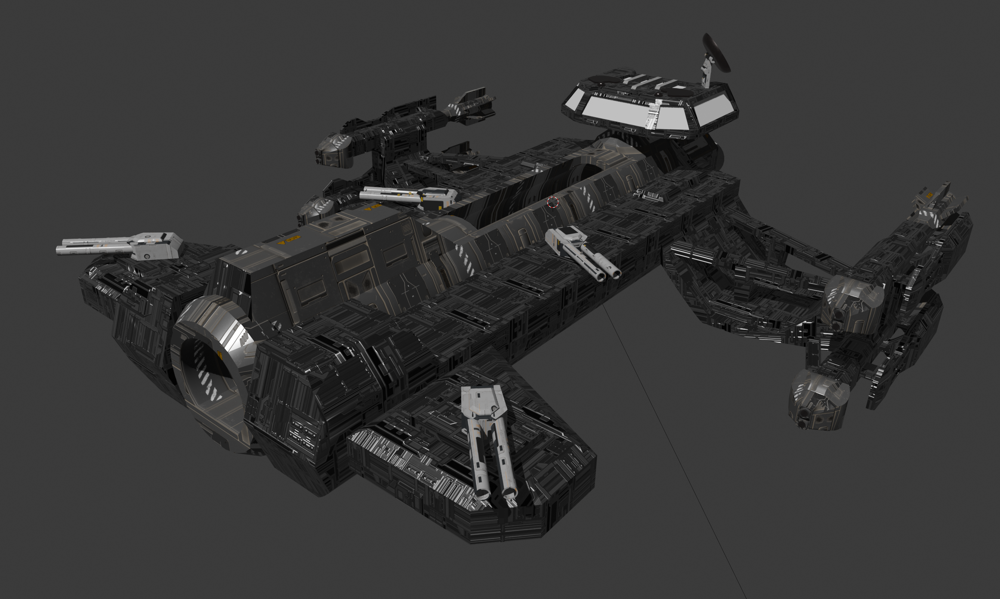
  <figcaption style="text-align:center;">Figure 5. Battlecruiser Render Preview (Blender).</figcaption>
</figure>

## 4.3 OpenGl loading

The `Battlecruiser` class encapsulates the complete rendering and animation logic for the 3D battlecruiser model, including mesh data management, texture binding, and shader communication, with the most crucial component being the Physically Based Rendering (PBR) shader (`mainShader`) used for all opaque surfaces.

This class is responsible for preparing OpenGL resources, including vertex buffers, textures, and vertex array objects (VAOs), binding the appropriate materials to the rendering pipeline, and ensuring that each mesh is drawn using the correct shading technique.

### 4.3.1 Model Integration and Resource Setup

The model geometry is imported from a triangulated `.OBJ` file using a custom utility function, `loadMesh()`.
Each mesh in the file corresponds to one of the material regions previously defined in Blender (see Section 1.2). These meshes are stored in GPU-ready structures (`MeshGL`), each containing:
- A Vertex Array Object (VAO) to describe vertex layout.
- Vertex Buffer Objects (VBOs) and Index Buffers (IBOs) to store vertex and index data.
- Texture handles and a material name for identifying associated textures.

The model-loading routine also initializes all texture maps by calling the helper function `Battlecruiser::loadTexture()`, which relies on the `stb_image` library (`stbi_load`) to read image data from disk.
This ensures consistent loading behavior for all texture types across materials: albedo, normal, metallic, and roughness.

Each material name (e.g., "Panel-0", "Panel-1", etc.) is linked to its respective set of texture maps through conditional bindings such as:
```c++
if (m.materialName == "Panel-0") {
    loadTexture("..._albedo.png",    m.baseMap);
    loadTexture("..._normal.png",    m.normalMap);
    loadTexture("..._metallic.png",  m.metallicMap);
    loadTexture("..._roughness.png", m.roughnessMap);
}
```

### 4.3.2 Shader Initialization

Three primary shaders are loaded and managed by the `Battlecruiser` class:
- `mainShader`: Implements the full PBR model for opaque materials, including metallic and roughness-based reflections.
- `reflectiveShader`: Used for the bridge windows (see Section 1.2.3). This shader produces a blue-tinted transparency and applies environment reflections from the skybox (discussed in Section 1.6).
- `thrusterShader`: Handles emissive lighting for the ship's engines, simulating fluctuating glow intensity.

The mainShader is loaded from two GLSL source files: `shader_vert.glsl` (vertex stage) and `shader_frag.glsl` (fragment stage).
Together, they implement the Cook–Torrance microfacet PBR model, sampling from the loaded textures and applying physically accurate lighting using directional and point light sources from the scene's planetary system.

### 4.3.3 Rendering Pipeline and Draw Passes

The `draw()` function governs the entire rendering process, executed each frame to draw the battlecruiser.
The method performs three main passes:

1. Pass 1: Opaque Meshes (PBR Shader)
    All opaque meshes (excluding the bridge glass) are rendered using the `mainShader`.
    Before drawing, the following uniforms are updated:
    - Model, View, and Projection matrices
    - Camera position
    - Lighting information from the `PlanetSystem`
    - Shadow and eclipse parameters
    - Exposure and gamma correction values
   
    Each mesh binds its associated textures before rendering:
    ```c++
    glActiveTexture(GL_TEXTURE0); glBindTexture(GL_TEXTURE_2D, m.baseMap);
    glActiveTexture(GL_TEXTURE1); glBindTexture(GL_TEXTURE_2D, m.normalMap);
    glActiveTexture(GL_TEXTURE2); glBindTexture(GL_TEXTURE_2D, m.metallicMap);
    glActiveTexture(GL_TEXTURE3); glBindTexture(GL_TEXTURE_2D, m.roughnessMap);
    ```
   
   These textures are linked to the shader sampler uniforms, for example:
    ```c++
    glUniform1i(mainShader.getUniformLocation("textureBase"), 0);
    ```
   
2. Pass 2: Reflective Surfaces
   Meshes with the material name `"Panel-10"` (the bridge windows) are rendered using the `reflectiveShader`, which samples from the environment cubemap (`cubemapTexture`).
   This simulates skybox reflections and a blue-tinted transparency for the cockpit glass.

3. Pass 3: Thruster Emission
   Finally, the thrusterShader renders the ship's engines, applying emissive lighting and randomized flickering.
   This is achieved using a uniform random distribution (`std::uniform_real_distribution`) to modulate glow intensity and hue, enhancing realism.

### 4.3.4 Class Overview
Below is a summary of the main public methods of the Battlecruiser class and their respective roles:

| **Method**         | **Role**                                                                 |
|--------------------|--------------------------------------------------------------------------|
| `loadTexture()`    | Loads and configures 2D textures for PBR materials.                      |
| `Battlecruiser()`  | Initializes geometry, materials, and shaders.                            |
| `draw()`           | Executes the full rendering pipeline (PBR, reflective, emissive passes). |
| `draw_shadowmap()` | Generates depth maps for shadow rendering (see Section 1.5).             |
| `updateLights()`   | Updates light-space matrices for shadow and eclipse calculations.        |

Through this modular pipeline, the battlecruiser integrates seamlessly into the OpenGL scene, with every component drawn through an optimized, material-aware rendering path.

## 4.4 PBR Shading

The Physically Based Rendering (PBR) shader is the centerpiece of the rendering pipeline, defining how light interacts with the battlecruiser's surfaces.
It takes as input the material texture maps (albedo, normal, metallic, roughness), camera position, and lighting data from the scene.
The shader's goal is to approximate real-world light behavior using physically consistent equations.

### 4.4.1 Vertex Shader Logic

In the vertex stage (`shader_vert.glsl`), the Model–View–Projection (MVP) transformation is applied to compute the final vertex position (`gl_Position`), and the world-space position is passed to the fragment shader for lighting computations.

An essential part of the vertex shader is the computation of the TBN matrix (Tangent, Bitangent, Normal), which allows correct transformation of normal vectors from tangent space (used by normal maps) into world space:

```glsl
vec3 T = normalize(vec3(model * vec4(tangent, 0.0)));
vec3 N = normalize(vec3(model * vec4(normal,  0.0)));
vec3 B = normalize(cross(N, T));

mat3 tbn = mat3(T, B, N);
```

Without this transformation, rotating the object would not correctly rotate its normal map details.

### 4.4.2 Fragment Shader Logic

In the fragment shader (`shader_frag.glsl`), the PBR lighting model is implemented using the Cook–Torrance microfacet BRDF.

First, the normal is reconstructed from the normal map using the TBN matrix:
```glsl
vec3 normalMap = texture(textureNormal, fragTexCoord).rgb;
vec3 normal = normalize(tbn * (normalMap * 2.0 - 1.0));
```

Then, the outgoing reflected light (`Lo`) is computed using the general PBR lighting equation:

$L_o = \int_i \left( f_{BRDF}(N, V, L) \cdot L_i \cdot \max(\text{dot}(N, L), 0) \right)$

where `N` is the surface normal, `V` the view vector, `L` is the light direction, and `L_i` is the radiance of the `i`-th light source. 

The BRDF term is decomposed as:

$f_{BRDF} = k_d \cdot f_{diffuse} + f_{specular}$

For the Diffuse term, a simple Lambertian model is used:

$f_{diffuse} = \frac{\text{color}}{\pi}$

For the Specular term, the Cook–Torrance model defines:

$f_{specular} = \frac{D \cdot G \cdot F}{4 \cdot (N \cdot V) \cdot (N \cdot L)}$

where:
- `D` is the Normal Distribution Function (NDF), GGX/Trowbridge–Reitz model:

  $D = \frac{\alpha^2}{\pi \big((N \cdot H)^2 (\alpha^2 - 1) + 1\big)^2}$;
  $\alpha = \text{roughness}^2$

- `G` is the geometry function (Smith–Schlick approximation):
  $G = G_1(N, L) \cdot G_1(N, V)$; 

    with $G_1(N, X) = \frac{N \cdot X}{(N \cdot X)(1 - k) + k}, \quad k = \frac{\alpha}{2}$

- `F` is the Fresnel term (Schlick's approximation):
  $F = F_0 + (1 - F_0)(1 - (V \cdot H))^5$

    where `F0` = 0.04 dielectrics and is linearly blended with the albedo color based on metallicity.

The diffuse weight is calculated as:

$k_d = (1 - F) \cdot (1 - \text{metallic})$

Finally, the computed color undergoes shadow and eclipse modulation (discussed in Section 1.5), and is gamma-corrected before being written to the frame buffer.

### 4.4.3 Summary
The PBR shader combines physically grounded reflectance equations with the precomputed texture data to deliver realistic visual effects: metallic highlights, micro-surface detail from normal maps, and natural diffuse lighting. We can observe the difference between using only the color texture (Figure 6) and applying the implemented PBR shader (Figure 7).
By integrating this model in OpenGL, the battlecruiser achieves a consistent, high-fidelity appearance under varying light conditions, forming the foundation for the advanced rendering stages such as shadow mapping and environment reflection covered in the following sections.

<figure>
  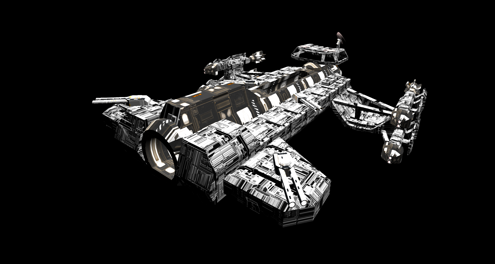
  <figcaption style="text-align:center;">Figure 6. Battlecruiser with Albedo shading</figcaption>
</figure>  


<figure>
  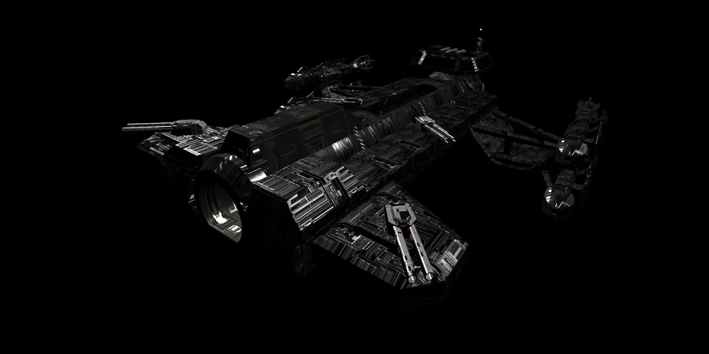
  <figcaption style="text-align:center;">Figure 7. Battlecruiser with PBR shading</figcaption>
</figure>  

## 4.5 Shadow Mapping and Eclipse Ray-Tracing (explained in section 6)

## 4.6 Environment Mapping Skybox

A special material, identified in the mesh as `Panel-10`, is reserved for the environment-mapped reflective surface of the battlecruiser, specifically, the bridge windows.
Unlike the opaque PBR materials, this material is rendered in a separate shader pass using the `reflectiveShader`, which implements environment mapping to simulate reflections from the surrounding skybox.

### 4.6.1 Overview of the Reflective Shader Pass

During the rendering sequence (executed in the `draw()` method of the `Battlecruiser` class), the reflective pass is performed immediately after all opaque meshes are drawn.

This pass activates the reflective shader, sets all necessary uniforms, including model, view, and projection matrices, as well as the camera position, and binds the cubemap texture that represents the scene's environment.

The reflective shader then draws only the meshes tagged with the material `"Panel-10"`, ensuring that only the designated reflective surfaces (the bridge windows) are affected.
After rendering, blending and depth testing states are reset to prepare for subsequent passes such as emissive lighting.

### 4.6.2 Cubemap Texture and Environment Mapping

The environment reflection relies on a cubemap texture, referenced in the shader as `cubemapTexture`.
A cubemap is a special type of OpenGL texture that contains six square images, each representing one face of a cube. These six textures correspond to the +X, -X, +Y, -Y, +Z, and -Z directions in world space.
When combined, they form a continuous, omnidirectional image that fully surrounds the scene, effectively functioning as a skybox.

Each texel in the cubemap encodes the color of the environment seen in that direction from the center of the cube.
This allows for realistic reflection lookups in shaders: given a reflection direction vector, OpenGL can sample the appropriate pixel from the cubemap, giving the illusion that the object is reflecting the entire environment around it.

The construction of this cubemap (including image loading, orientation, and skybox rendering) will be described in detail in Section 3, which focuses on the skybox and environment setup.

### 4.6.3 Fragment Shader Operation

The fragment shader used for this pass, located at `shaders/battlecruiser/glass_shader_frag.glsl`, computes reflections and transparency effects to simulate glass-like material behavior.

The core steps of the shader are as follows:
1. View and Reflection Vector Calculation
   The shader computes the direction from the camera to the fragment and then reflects that vector around the fragment's surface normal (normal):

    ```glsl
    vec3 I = normalize(fragPos - cameraPos);
    vec3 R = reflect(I, normalize(fragNormal));
    ``` 
   
2. Cubemap Sampling
   The reflection vector `R` is used to sample the cubemap texture, which returns the reflected environment color:

    ```glsl
    vec3 envColor = texture(environmentMap, R).rgb;
    ``` 
   
3. Tint and Transparency Application
   A soft blue-white tint is applied to mimic the coloration of futuristic spacecraft glass, then the shader outputs the tinted color with partial transparency:

    ```glsl
    vec3 glassTint = vec3(0.8, 0.9, 1.0);
    vec4 outColor = vec4(mix(glassTint, envColor, 0.7), 0.6);
    ``` 

This process gives the bridge windows a glossy, semi-transparent appearance that dynamically reflects the surrounding environment, resulting in a physically plausible, glass-like finish consistent with the PBR workflow (Figure 8).

<figure>
  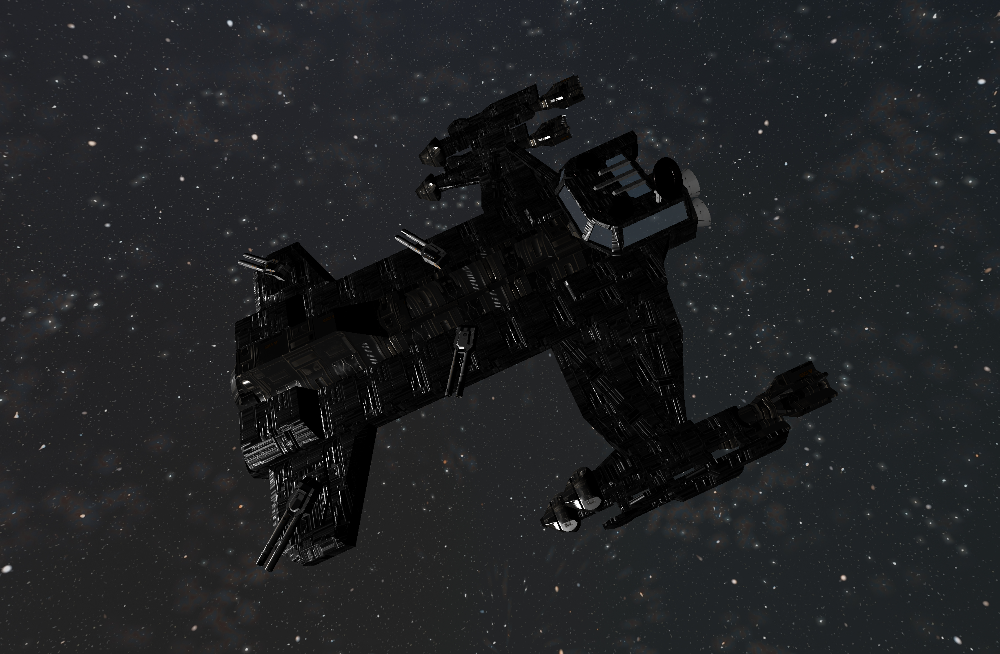
  <figcaption style="text-align:center;">Figure 8. Battlecruiser with environment mapping</figcaption>
</figure>  
    
## 4.7 Particles

At this stage, the battlecruiser model is visually complete, featuring detailed PBR materials and reflective surfaces. However, to further enhance realism (particularly for the thruster exhaust), a particle system is introduced. This system simulates small, semi-transparent particles that collectively form flame and smoke effects at the rear of the spacecraft.

A particle system provides an optimized and visually convincing way to represent phenomena such as fire, smoke, or sparks by rendering many tiny 2D quads (billboards) that always face the camera. Each quad carries a partially transparent texture (or simply a colored alpha-blended region). When hundreds or thousands of these quads are drawn together, they create the illusion of a continuous, dynamic effect.

### 4.7.1 System Overview

The particle system is implemented in the `ParticleSystem` class, which manages simulation, updates, and rendering of thousands of lightweight particles in real time.

Each particle is defined using the following structure:
```c++
struct Particle {
    glm::vec3 pos;
    glm::vec3 speed;
    unsigned char r, g, b, a;
    float size;
    float life;
    float cameraDistance;

    bool operator<(const Particle& that) const {
        return cameraDistance > that.cameraDistance;
    }
};
```

Each `Particle` instance contains attributes for position, velocity, size, color, lifespan, and camera distance (used for sorting transparent objects).

Particles are stored in a dynamic vector (`particles`) and managed through three major stages:
1. Spawning
2. Updating
3. Drawing

### 4.7.2 Spawning and Initialization

The `spawn_per_location()` method governs particle creation. Rather than continuously allocating and freeing memory, the system reuses inactive particles by locating available ones using `findUnusedParticle()`. his ensures optimal performance even when thousands of particles are active.

Each new particle receives randomized initial properties to achieve natural variation:
- Life and Size: Randomized using deviation parameters (`lifeDeviation`, `sizeDeviation`)
- Color: Slightly varied around a base yellow–red tone (`colorR`, `colorG`, `colorB`) to simulate fire
- Position: Spawned near the thruster origin, within a random radius (`spawnRadius`)
- Velocity: Given directional spread through a cone angle (`coneAngle`) and velocitySpread, creating the effect of chaotic exhaust flow

This randomness ensures that each particle is visually unique and prevents repetitive or artificial patterns.

### 4.7.3 Update Stage

Each frame, the system calls the `update_stage()` method, which updates all active particles based on the elapsed time (`dt`):
- Life Decrement: The `life` of each particle is reduced by `dt`. Once it falls below zero, the particle becomes inactive and is available for reuse.
- Position Update: Each particle's position is advanced using its velocity (`p.pos += p.speed * dt`), simulating motion.
- Fading: As life decreases, the alpha channel (`p.a`) is proportionally reduced, causing the particle to fade smoothly before disappearing.
- Sorting: To ensure correct transparency blending, particles are sorted by their distance to the camera (`cameraDistance`) using `std::sort`.
  This ensures that distant particles are drawn before closer ones, compensating for OpenGL's order-dependent transparency rendering.

This stage gives the illusion of particles being emitted, moving outward, and dissipating naturally.

### 4.7.4 Rendering Stage and Billboarding

Rendering is handled by the `draw_stage()` method. Particles are rendered as billboards (flat quads that always face the camera), using a single instanced draw call (`glDrawArraysInstanced`).

To orient each quad correctly, the camera right and camera up vectors are derived from the view matrix and passed to the shader as uniforms (`CameraRight_worldspace`, `CameraUp_worldspace`).
Each particle quad is then reconstructed around its center position (`inPositionSize`) using these vectors, ensuring it always faces the camera regardless of camera orientation.

Particle attributes such as position, size, and color are uploaded each frame to GPU buffers:
```c++
glBindBuffer(GL_ARRAY_BUFFER, _vboPositions);
glBufferSubData(GL_ARRAY_BUFFER, 0, particleCount * sizeof(glm::vec4), _posSizeData);

glBindBuffer(GL_ARRAY_BUFFER, _vboColors);
glBufferSubData(GL_ARRAY_BUFFER, 0, particleCount * sizeof(glm::vec4), _colorData);
```

To correctly blend semi-transparent particles:
- Blending is enabled with:
    ```c++
    glEnable(GL_BLEND);
    glBlendFunc(GL_SRC_ALPHA, GL_ONE_MINUS_SRC_ALPHA);
    ```
  
- Depth writes are disabled (`glDepthMask(GL_FALSE)`) to prevent depth buffer conflicts.

This combination allows overlapping flame and smoke particles to blend smoothly, forming a cohesive and dynamic exhaust effect.

### 4.7.5 Particle Vertex Shader

The vertex shader (`shaders/battlecruiser/particle_vertex.glsl`) performs the billboarding transformation.

Each particle instance is represented by four vertex offsets (`quadCorner`), corresponding to the corners of a unit square.
For each particle, the shader expands this square around its position and orients it toward the camera using the right and up vectors:

```glsl
vec3 center = inPositionSize.xyz;
float size  = inPositionSize.w;

vec3 worldPos = center.xyz
              + CameraRight_worldspace * quadCorner.x * size
              + CameraUp_worldspace    * quadCorner.y * size;

gl_Position = projection * view * vec4(worldPos, 1.0);
vColor = inColor;
```

This ensures that every quad always faces the viewer, regardless of camera movement or model rotation.
The fragment shader simply outputs the interpolated color with alpha transparency, producing additive or translucent blending depending on the chosen effect. The result can be seen in Figure 9. 

<figure>
  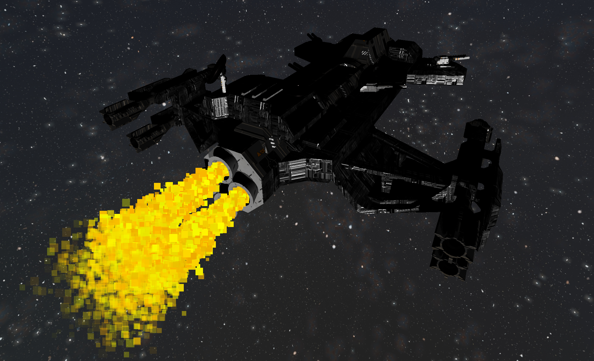
  <figcaption style="text-align:center;">Figure 9. Battlecruiser with particles</figcaption>
</figure>  

### 4.7.6 Summary

The particle system provides a lightweight yet visually compelling effect to simulate thruster flames and other dynamic visual phenomena.

By using GPU instancing, billboarding, and alpha blending, thousands of particles can be updated and rendered each frame with minimal overhead.

This system complements the battlecruiser's PBR-rendered body, adding motion and life to the spacecraft as it maneuvers, a key step before implementing free movement and path control in Section 1.9.

## 4.8 Light Particles

While the particle system described in Section 1.7 successfully creates the illusion of a dynamic exhaust flame, the particles themselves do not emit light into the scene (Figure 10). As a result, when the battlecruiser is positioned in shadow, particularly behind planetary bodies, the thruster flames appear visually disconnected from their surroundings, as shown in Figure 7.

<figure>
  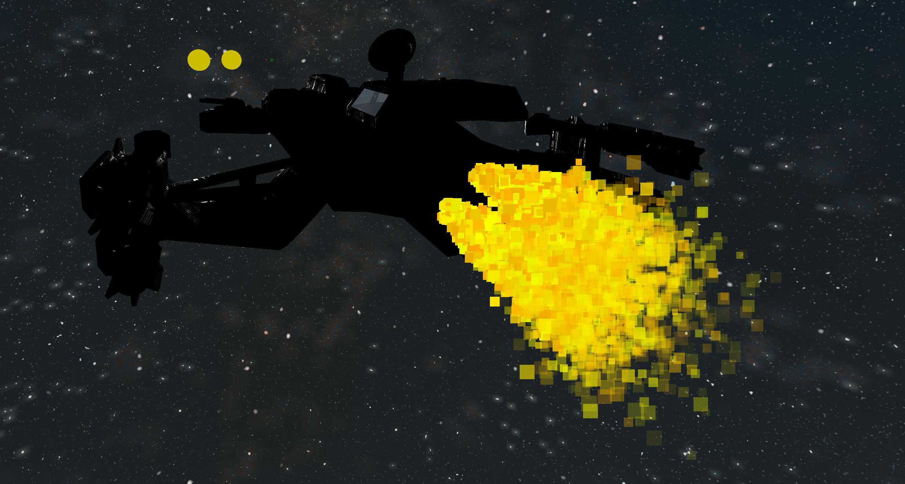
  <figcaption style="text-align:center;">Figure 10. Battlecruiser with particles, but in shadow</figcaption>
</figure>  

To address this limitation, a light particle simulation is introduced to mimic thruster illumination on nearby geometry.

### 4.8.1 Motivation and Design Constraints

Naively converting each particle into a point light source would require computing lighting equations for thousands of lights, leading to an exponential performance drop and making this approach impractical in real time.

Instead, a procedural lighting model is employed. This technique simulates the cumulative lighting contribution of many tiny particles using only a few virtual light sources strategically positioned around the thrusters.

The idea is to arrange these lights in concentric circular layers, centered on the thrusters exit. Each layer (or "ring") contains several light points evenly distributed around its circumference. As the radius increases, the number of lights per ring also increases, creating a natural gradient of illumination.

When configured correctly, the outermost ring coincides with the widest dispersion of exhaust particles, producing a visually convincing lighting effect without the computational overhead of per-particle illumination.

### 4.8.2 Implementation in the Rendering Pipeline

This lighting effect occurs in the third rendering pass of the `Battlecruiser::draw()` function.
After the PBR and reflective passes are completed, the `thrusterShader` is activated to render the simulated thruster illumination.

Controlled randomness is introduced each frame using `std::uniform_real_distribution` and `std::uniform_int_distribution` to vary the thruster's color, radius, and light intensity.
This produces natural flickering and color shifts, imitating the instability of plasma or combustion within the engine.

The base hue oscillates between warm red–yellow tones, while the radius and brightness fluctuate subtly, giving a sense of organic energy and motion.
This randomization affects the following parameters:
- Color components: `distR`, `distG`
- Light radius variation: `flickerDist`
- Emission intensity: randomized scalar multiplier

The shader then procedurally computes the contribution of multiple circular light layers without creating explicit point light objects, maintaining performance efficiency.

### 4.8.3 Shader Architecture and Light Distribution

The fragment shader, implemented in `shaders/battlecruiser/thruster_frag.glsl`, simulates illumination using a parametric ring-based distribution of lights.

The shader transforms the thruster base position (`thrusterLightPos`) into world space and defines the primary thrust direction (`thrusterDir`).
To distribute lights around this direction, two orthogonal vectors (`u` and `v`) are computed to form a local 2D plane perpendicular to the thruster axis:

```glsl
vec3 u = normalize(cross(thrusterDir, vec3(0.0, 1.0, 0.0)));
vec3 v = cross(thrusterDir, u);
```

The shader iterates through three rings (`j = 1..3`), each with increasing radius (`radiusLight`) proportional to the thruster's total radius:
```glsl
for (int j = 1; j <= 3; ++j) {
    float radiusLight = thrusterRadius * (float(j) / 3.0);
    for (int i = 0; i < nrLights; ++i) {
        float angle = (2.0 * PI * i) / float(nrLights);
        vec3 lightPos = thrusterWorldPos
            + radiusLight * (cos(angle) * u + sin(angle) * v);
        ...
    }
}
```

For each virtual light position, the shader computes:
- Attenuation: A smooth quadratic falloff based on distance
- Lambertian Diffuse Term
- Contribution Accumulation: Each light adds its weighted color to the total illumination

A bright central hotspot is then added at the core (`thrusterWorldPos`) to emphasize the exhaust center and simulate the brightest combustion zone.

This approach reproduces the complex lighting of thousands of small flames using only a handful of mathematical operations per fragment, achieving an ideal balance between visual fidelity and performance efficiency.

### 4.8.4 Integration with the PBR Pipeline

The thruster lighting shader operates synergistically with the PBR shading described in Section 1.4.
Although these lights are not physically simulated light sources, their radiance integrates naturally into the PBR reflection and diffuse equations of nearby geometry.

Due to time constraints, the current implementation approximates the lighting as a color overlay rather than a physically accurate light contribution. As a result, in fully shadowed regions, the PBR material details are not visible—only the additive glow from the overlay effect is present.

Despite this simplification, the technique effectively ensures that the rear hull panels and engine components receive a visually consistent amount of warm, flickering illumination, producing a cohesive appearance even in dark or partially shadowed environments (Figure 11).
<figure>
  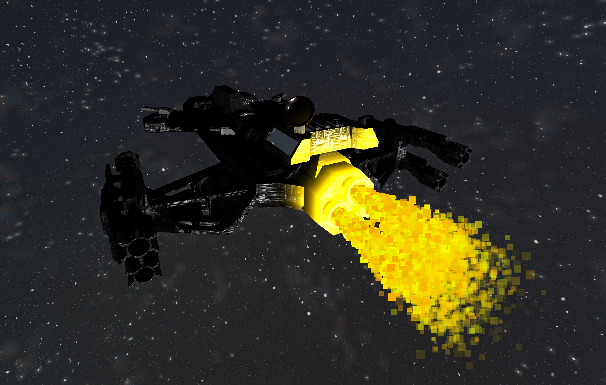
  <figcaption style="text-align:center;">Figure 11. Battlecruiser with light particles</figcaption>
</figure>  

## 4.9 Movement

The final stage of the battlecruiser implementation involves enabling dynamic movement, allowing both user-controlled flight and automatic motion along a predefined Bezier path.

This dual movement system provides a balance between interactivity and cinematic animation, showcasing the model's shading, lighting, and particle effects in motion.

### 4.9.1 Manual (Free) Movement

To make the battlecruiser fully controllable, the user can fly the ship freely using keyboard inputs. The control scheme follows a simple and intuitive airplane-like setup:
- Up Arrow: Moves the ship forward along the world Y-axis.
- Down Arrow: Moves the ship backward (negative Y direction).
- Left / Right Arrows: Rotates the ship around the world Y-axis (yaw rotation).

Although this setup restricts movement primarily to the Y-axis for simplicity, it provides an effective and responsive control method suitable for arcade-style flight dynamics.

The motion logic is implemented in the function `updateVelocityPositionFreeMovement(deltaTime)`, which ensures smooth motion, orientation, and velocity updates independent of frame rate.

### 4.9.2 Flight Dynamics and Control Parameters

The function begins by computing the current speed magnitude:

```c++
float initialSpeed = glm::length(velocity);
```

This speed influences several parameters dynamically:
- Rotation sensitivity (`sensitivityRotationX`, `sensitivityRotationY`)
- Maximum bank angle (`maxBankAngle`)
- Pitch sensitivity (`maxPitch`)

These relationships ensure the ship feels progressively more agile as it gains speed, enhancing the sense of flight realism.

The directional control is represented by the:
- Yaw Rotation: Controlled via left/right arrows, rotating the ship around the world's up-axis (`glm::vec3(0, 1, 0)`).
- Pitch Rotation: Controlled by up/down arrows, rotating the ship around its local right vector. A maximum pitch angle (`maxPitch`) prevents over-rotation or flipping.

The speed control, or throttle, is managed using Page Up / Page Down keys:
- Page Up: Increases forward velocity smoothly.
- Page Down: Reduces speed.

The velocity is clamped within the range `[0.2f, 3.0f]` to maintain stability.

The position is then updated using frame-rate–independent motion:

```c++
position += velocity * deltaTime;
```

To simulate the natural roll of an aircraft during turns, a banking effect is added:
- A target roll angle (`targetBankAngle`) is computed based on turn direction.
- The ship's roll is smoothly interpolated toward this target using `glm::mix()`, controlled by `bankSensitivity`.
- A roll transformation matrix (`rollMatrix`) tilts the ship's up vector, creating the illusion of physically responsive flight.

The result is a smooth, realistic motion system where the ship banks into turns, maintaining both responsiveness and physical believability (Figure 12).

<figure>
  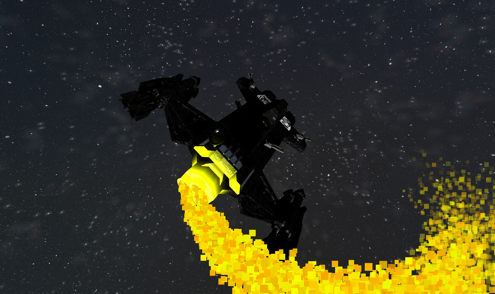
  <figcaption style="text-align:center;">Figure 12. Battlecruiser turning with roll effect</figcaption>
</figure>  

### 4.9.3 Integration with Particle Effects

The ship's current velocity vector directly influences the particle system described in Section 1.7. Specifically:
- The particle size and spread parameters scale proportionally with velocity (Figure 13).
- Faster speeds generate longer, narrower thruster trails, while slower speeds create shorter, more diffuse emissions (Figure 13).
- This linkage between movement and visual feedback ensures the thruster flame adapts naturally to the ship's current motion, enhancing immersion and realism (Figure 12).

<figure>
  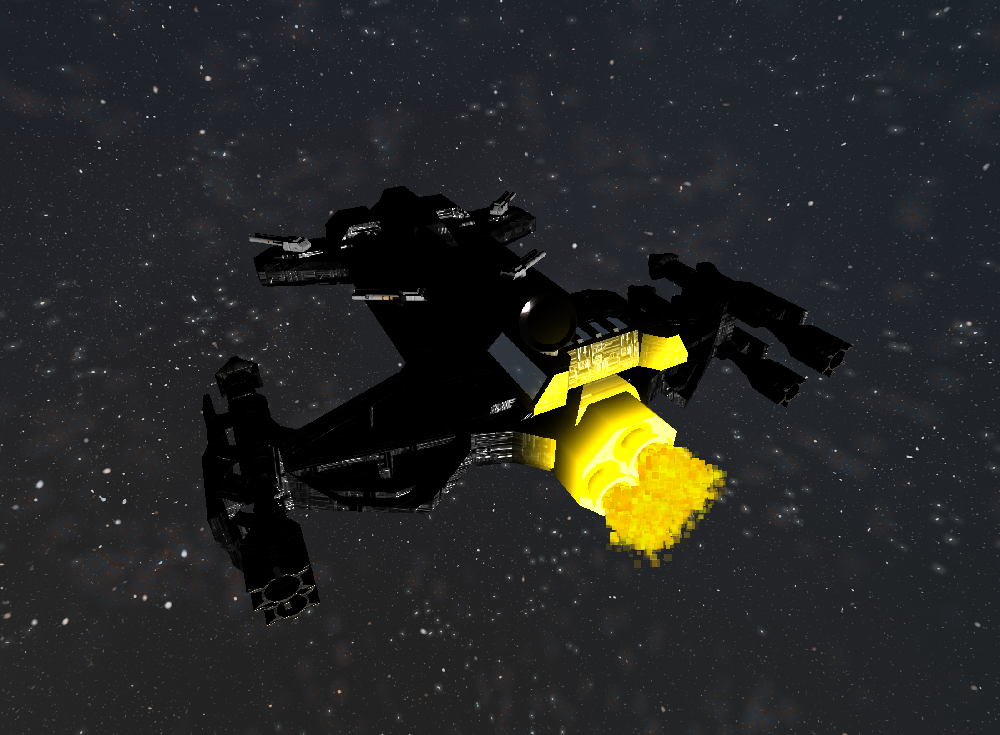
  <figcaption style="text-align:center;">Figure 13. Battlecruiser at minimum speed</figcaption>
</figure>


### 4.9.4 Automated Bezier Path Movement

In addition to manual controls, the battlecruiser can also follow an automated flight path defined by a cubic Bezier curve system.
This feature enables cinematic camera sequences, pre-scripted routes, or demo flights where the ship navigates smoothly through space without user input.

The Bezier motion logic is implemented in the dedicated `BezierPath` class.

The Bezier path is composed of four cubic Bezier curves, each defined by four control points (`p0`, `p1`, `p2`, `p3`).

The path is generated dynamically, with the first and last segments initialized from the ship's current position and velocity vector, ensuring a seamless transition between free flight and automated motion.

The method `initializeBezierPathMovement()` constructs the complete sequence of connected curves.
Each curve's shape is determined by sets of control points (`origin_point_list`, `previous_point_list`) and scaling factors that dictate curvature and continuity between segments.

To ensure constant-speed traversal, the system does not rely directly on the raw Bezier parameter `t`, since the spacing of points along the curve is non-linear with respect to arc length.
Instead, each segment undergoes arc-length reparameterization via the function `computeArcLengthTable()`.
This process guarantees that the battlecruiser moves at a uniform world-space speed, even across curves of varying curvature.

The cubic Bézier curve is defined by four control points: `p0`, `p1`, `p2` and `p3`, and parameter t between the closed interval [0, 1]. The position of any point along the curve is given by:

$$
P(t) = (1 - t)^3 P_0 + 3(1 - t)^2 t P_1 + 3(1 - t)t^2 P_2 + t^3 P_3
$$

The first derivative (used to obtain the tangent direction) is:

$$
P'(t) = 3(1 - t)^2 (P_1 - P_0) + 6(1 - t)t (P_2 - P_1) + 3t^2 (P_3 - P_2)
$$

In practice, the `computeBezierPoint(t)` and `derivativeBezier(t)` functions implement these equations directly.

The derivative is normalized to determine the forward direction vector of the ship along the curve.

Because `t` does not correspond linearly to the physical distance along the curve, each segment is sampled at small intervals of `t` to approximate its arc length.
At each step:
1. The Bézier point `P(t_i)` is computed.
2. The distance to the previous point is accumulated and stored in a`ccValues[i]`.
3. The corresponding parameter `t_i` is stored in `tValues[i]`.

This process yields a discrete lookup table that relates arc length to parameter values.

During runtime, the battlecruiser's movement is expressed in terms of distance traveled, not `t`. To find this `t`, the function `findTFromArcLength()` performs a binary search on accValues and interpolates linearly between the nearest samples in `tValues`.
The resulting `t` ensures constant motion speed along the curve, independent of curve tightness or local curvature.

This method effectively reparametrizes the Bézier curve by arc length, yielding smooth, constant-speed traversal and stable animation timing. We can see the comparison between Figures 15 and 16 between a normal cubic Bezier path and the reparametrized Bezier path.

<figure>
  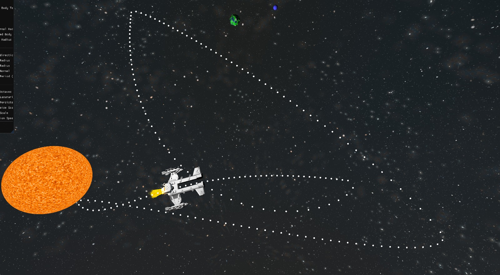
  <figcaption style="text-align:center;">Figure 14. Normal Bezier path (non-constant speed)</figcaption>
</figure>  

<figure>
  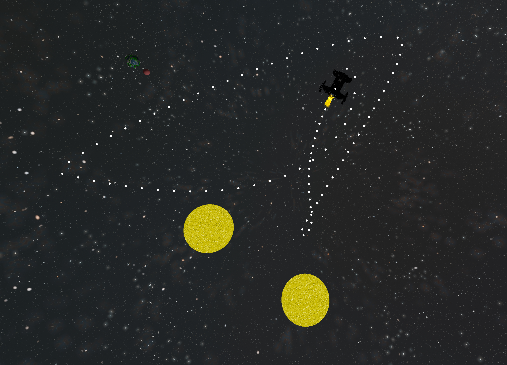
  <figcaption style="text-align:center;">Figure 15. Reparametrized Bezier path (constant speed)</figcaption>
</figure>  

### 4.9.5 Path Following and Rendering
During automatic motion, the function `updateVelocityPositionPathMovement()` advances the battlecruiser along the Bezier curve based on the distance traveled:
- The parameter `timeBezierPath` accumulates the traveled arc length.
- The corresponding `t` value is retrieved using the arc-length lookup table.
- The ship's position is updated to the Bezier point at `t`.
- The ship's velocity vector aligns with the curve tangent, calculated using `derivativeBezier()`.

When one curve is completed, the algorithm transitions to the next segment, looping seamlessly if necessary.
For visualization, the `draw()` function binds the `bezierShader` and renders sampled path points (`positionPoints`) in world space.
These precomputed samples, generated during initialization, trace the exact Bezier trajectory.
The result is a glowing, dotted line that visually represents the battlecruiser's flight path, effectively turning an invisible trajectory into a visible, dynamic element of the scene (Figure 16).

<figure>
  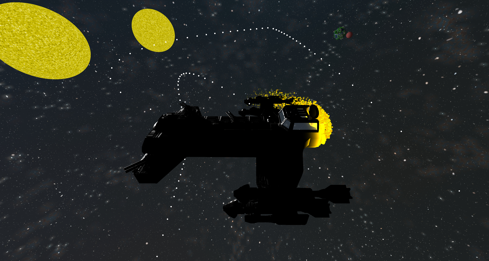
  <figcaption style="text-align:center;">Figure 16. Battlecruiser following a Bezier path</figcaption>
</figure>  

### 4.9.6 Summary

The movement system integrates both interactive control and autonomous motion, creating a flexible and immersive flight experience.
Free movement allows player-directed exploration, complete with responsive banking and velocity-linked thruster feedback.
Meanwhile, the Bezier path mechanism enables smooth, cinematic trajectories using mathematically precise spline curves with constant-speed traversal.

Together, these two approaches ensure the battlecruiser behaves realistically, whether steered by the user or following a precomputed flight path, and that its visual effects (particles, lighting, reflections) remain consistent and synchronized with motion.

# 5. Solar System
## 5.1 Celestial Bodies

The celestial bodies in our system use a runtime generated mesh of a class I geodesic icosahedron [https://en.wikipedia.org/wiki/Geodesic_polyhedron#Class_I].

This mesh is generated with a frequency (`toml:planets.ico_mesh_resolution`) and then used to render all celestial bodies in our project. The difference made by using a geodesic icosahedron instead of a regular icosahedron is in Figure 1 below.

| Regular Icosahedron          | Geodesic Icosahedron         |
|:-------------------:|:-------------------:|
| `geodesic_resolution_1.toml` | `geodesic_resolution_3.toml` |
|  |  |

*Figure 1: Comparison between a regular icosahedron and a class I geodesic icosahedron mesh with frequency 3 used for celestial bodies.*

We implement 4 types of celestial bodies (some of which we will go into more depth below):
- Default body (This is the parent class of all other body types and implements default behaviour. It is used as a placeholder for moons.)
- Star
- Earth
- Null body (not rendered, but used for orbital anchoring)

Default bodies also have basic attributes like position, color(`imgui:Fallback Color`, `toml:planets.fallback_color`), ka(`toml:planets.fallback_ka`), kd(`toml:planets.fallback_kd`), and radius. The radius can also be configured using imgui, or toml (we explain this below). n.b. The color, ka, and kd are not used if the body is a child class of default body.

## 5.2 Tessellation

All Cellestial bodies implement adaptive tessellation to improve the resolution of the geodesic icosahedron mesh.

This can be toggled(`imgui:Body Tessellation`, `toml:planets.enable_body_tesellation`), and can be made to adjust the height of triangles in pixels(`imgui:Target Body Tessellation Triangle Height`, `toml:target_triangle_height`).

The reason for adding gpu side tessellation alongside cpu side tesselation (the geodesic icosahedron) is because it is dynamic. However, the increase of resolution that can be achieved in opengl with tesselation is limited, so we still need cpu side tessellation. Another reason for using both is that with CPU tesselation we have more control over how triangles are split, resulting in a better distribution.

An alternative to this method would be to use a high triangle count mesh of a sphere but because of the way we implemented terrain (see below Earth section), tessellation is better suited to our needs.

Below is a table comparing (on a geodesic with frequency 1) tesselation off, tesselation with target triangle hegiht 100, and tesselation with target triangle height 1.

| Tessellation Off | Triangle Height 100 | Triangle Height 1 |
|:----------------:|:-------------------:|:-----------------:|
| `tessellation_off.toml` | `tessellation_on_100.toml` | `tessellation_on_1.toml` |
|  |  |  |

*Figure 2: Comparison of tessellation settings on a geodesic icosahedron mesh with frequency 1.*

The tesselation evaluation step is basic, it just outputs worldspace position, normalized position on the sphere (i.e. model space position), and the clip space position. However, the earth implements a more advanced tesselation evaluation, which will be explained in the Earth section.

## 5.3 Stars

Stars implement color using temperature. This is configurable as a global default(`toml:planets.star.default_star_temperature`) and on a per star basis(`imgui:Temperature (C)`). Cold stars are red and the hottest are light blue. This temperature factor also impacts their light intensity.


*Figure 3: Star color comparison based on temperature in Celsius, from left to right 3000, 4500, 5778 (Sun), 10000 and 30000.* 

## 5.4 Stars: Animated textures

Stars also implement animated textures(`toml:planets.star.enable_star_texture`, `imgui: Enable Star Texture / Animation`). These textures are implemented using 4d noise in the fragment shader. The base opensimplex noise is taken from https://github.com/stegu/webgl-noise. Using this we implemented a fractal noise algorithm, which is used in conjunction with domain warping to get swirls. this value is then used to interpolate colors (based on temperature) to get a nice looking star.

The 4 dimensions are needed because we are sampling the noise at the fragPosition(3D) at the point in time t, our 4th dimension. Parameters for the noise function can be configured(`toml:planets.star`).


*Figure 4: Star with animated textures enabled. To see the effect run the project, or look at the demo.*

## 5.5 Earth Terrain

The earth body type implements a procedural terrain shader (`imgui:Enable Planet Terrain Generation`). This shader uses 3D opensimplex noise (same as the star, but 3D) to displace the vertices of the earth in the tesselation evaluation shader. The noise parameters can be configured(`toml:planets.earth`). This noise value is also enhanced by implementing a fractal noise algorithm. It is then multiplied by two and raised to the power of 1.5 (while preserving sign) to get more pronounced terrain features. This value is then compared to the ocean level(`imgui: Ocean Level`, `toml:planets.earth.ocean_level`) to determine if the vertex is underwater or above water. If it is underwater, the vertices are displaced on the sphere of radius equivalent to the ocean level, otherwise they are displaced on the sphere of radius equal to the ocean level plus the noise displacement.

| Terrain Off | Terrain On(no tessellation) | Terrain On(tessellation) |
|:----------------:|:-------------------:|:-----------------:|
| 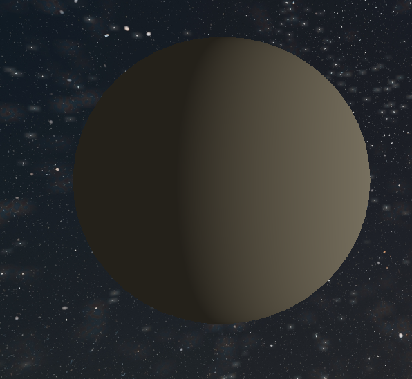 | 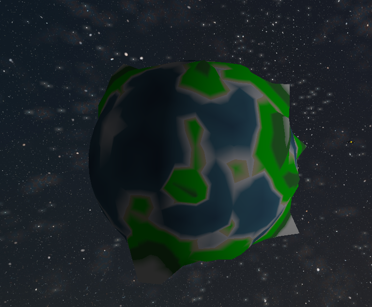  | 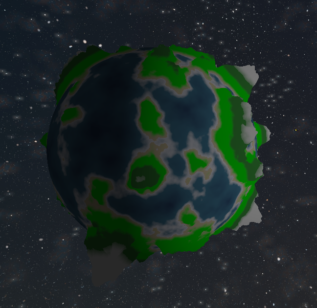 |

*Figure 5: Comparison of earth terrain generation settings. This displays the benefit of using tesselation as well.*

The color of the surface is alos determined by the height. Transitoning from beach to grass, forest and snow.

## 5.6 Earth Surface Normals

The earth fragment shader also implements a noise based surface normal map(`imgui:Enable Planet Surface Normals`). This is done by sampling the same fractal 3D noise function as the above, and using the derivatives of this noise to perturb the normal. The parameters for this noise can also be configured(`toml:planets.earth.shape_noise_*`).

This normal is also used to use gray color for cliffs, i.e. where the slope is steep.
| Surface Normals Off | Surface Normals On |
|:----------------:|:-------------------:|
| 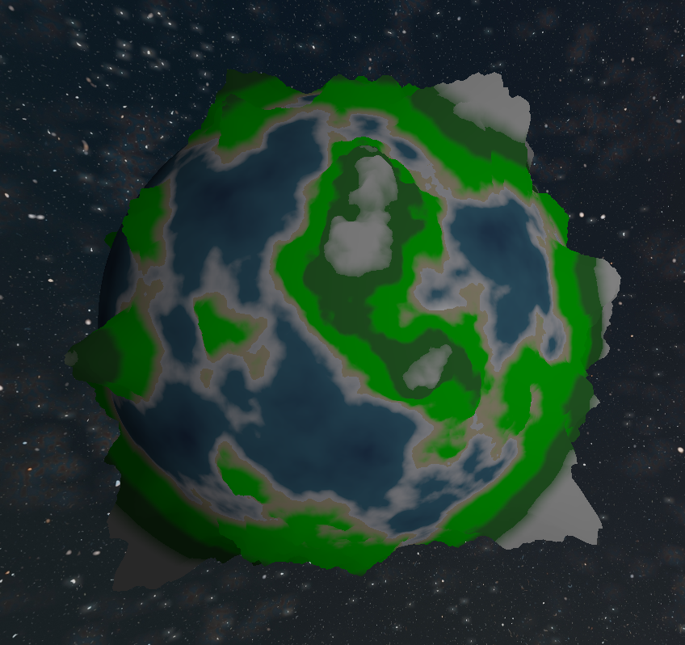 | 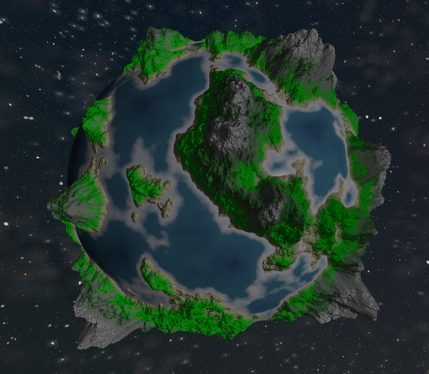  |

*Figure 6: Comparison of earth surface normal settings. Note the added detail on the terrain when normals are enabled.*


## 5.7 Earth Water

The earth fragment shader also implements a noise based water normal map(`imgui:Enable Planet Water Normals`, `toml:`). This is done by sampling another fractal 4D noise function, and using the derivatives of this noise to perturb the normal. The parameters for this noise can also be configured(`toml:planets.earth.water_noise_*`).

| Water Normals Off | Water Normals On |
|:----------------:|:-------------------:|
| 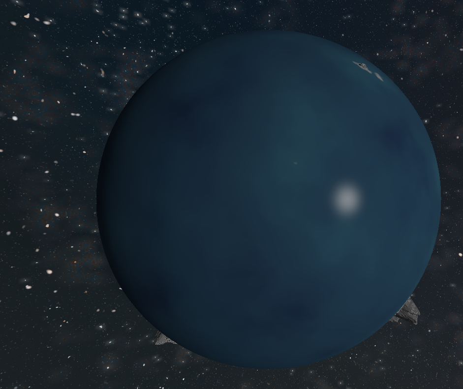 | 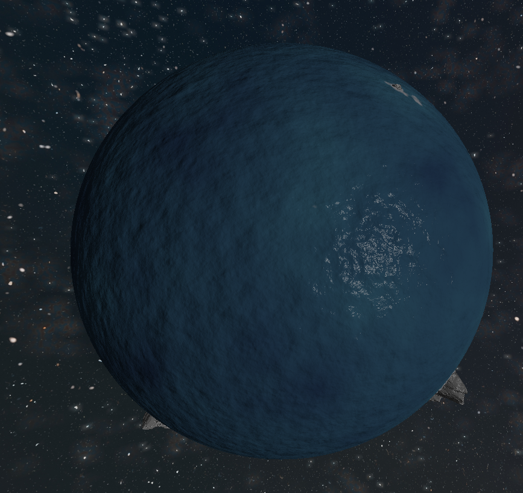  |

*Figure 7: Comparison of earth water normal settings. Note the added detail on the water surface when normals are enabled. Note: the mountains peeking through are to be ignored, because, in order to take these screenshots, I increased the ocean level.*

The water also has color based on the depth of the ocean at that point. The deeper the water, the darker the blue, and the shore is white to represent foam.

**Note:** these noise functions are all computed in the shaders, no precomputed textures are used. This allows for infinite resolution and seamless texturing, however it is more computationally expensive.

## 5.8 Hierarchical transformations

Celestial bodies are stored in a list, but each body also has a pointer to its parent body (if it has one). This allows us to implement hierarchical transformations, where a body's position is relative to its parent. For example, a moon's position is relative to the planet it orbits. 

For simplicity, we do not update the bodies using a topological sort, instead we just update them in the order they are stored in the list. This means that there is a lag in the position update of child bodies, but this is negligible for our purposes.

There is an imgui slidder to select a body to view and edit its parameters(`imgui: Selected Body`).

The orbits are eliptical, with the parent being at one of the foci. The orbital parameters (major radius (`imgui: large radius`), minor radius (`imgui: small radius`), direction (`imgui: orbit direction`) and normal (of the orbital plane) (`imgui: orbit normal`)) are configurable for the selected planet.

The whole solar system can be set up in the toml config file(`toml:planets.planets_info`), where each body has a type, parent, and optional orbit parameters like in the example below:
```toml
[planets]
planets_info = [
    # example entries:
    # [type, radius, parent_id = -1, ...] -> no orbit, static planet at (0, 0, 0) OR
    # [type, radius, parent_id, orbit_direction, orbit_small_r, orbit_large_r, orbit_normal, orbit_period]
    # type can be "star", "earth", "null" or "body"

    # Default single planet system
    ["star", 4.0, -1, [0.0, 0.0, 0.0], 0.0, 0.0, [0.0, 1.0, 0.0], 0.0],
    ["earth", 1.0, 0, [1.0, 0.0, 0.0], 40.0, 40.0, [0.0, 1.0, 0.0], 100000.0],
    ["body", 0.5, 1, [0.0, 0.0, 1.0], 10.0, 10.0, [0.0, 1.0, 0.0], 2.0],
]
```

We also have the option of creating binary star systems using null bodies as orbital anchors. The binary flag(`toml:planets.binary_system`) is used for shadow and lighting calulations (explained below). Otherwise, only the first star in the bodies list is considered for lighting calculations, but many stars can be rendered. The null body type is used for orbital anchoring, it is not rendered, but can be used as a parent for other bodies. This is useful for creating binary star systems where the stars orbit a null body.

Additionally, we have buttons to add earths and default bodies to the solar system at runtime(`imgui: Add Earth`, `imgui: Add Default Body`). These bodies are added as children of the currently selected body, and they get selected automatically, so their orbital parameters can be edited right away.

Another configurable attribute is a time multiplier(`imgui: time warp`) which speeds up or slows down the planets simulation time. This is useful for observing the orbits of bodies in the solar system.

# 6. Lighting and Shading

## 6.1 Eclipses

    We implement eclipses for both single and binary star systems(`imgui:enable eclipses`). Celestial bodies can cast shadows on each other and the ship. This is done by comparing the apparent sizes and angular separations of celestial bodies as seen from a given point. Each body and the light source (the sun) are projected as discs on the sky, with angular radii determined by their physical size and distance. By evaluating how much these discs overlap, the algorithm estimates the fraction of the sun’s disc that is obscured, yielding a continuous eclipse factor between zero and one. It assumes simple geometric occlusion without detailed umbra or penumbra modeling, combining multiple overlaps multiplicatively to approximate partial and total eclipses. This is done in the fragment shader for both celestial bodies and the ship.

    | No Eclipse | Eclipse | Eclipse + Earth |
    |:----------------:|:-------------------:|:-----------------:|
    | 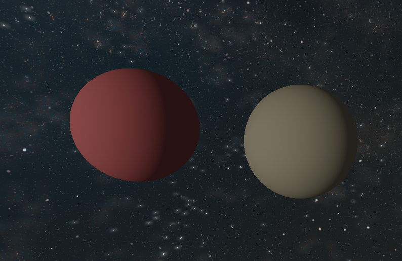 | 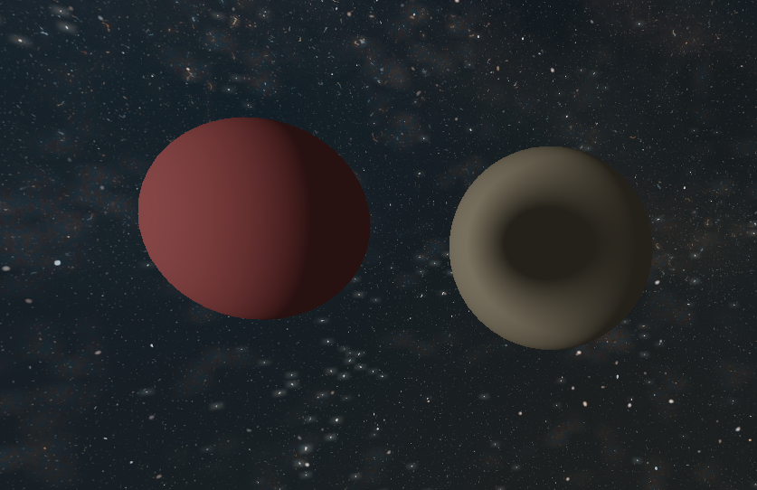  | 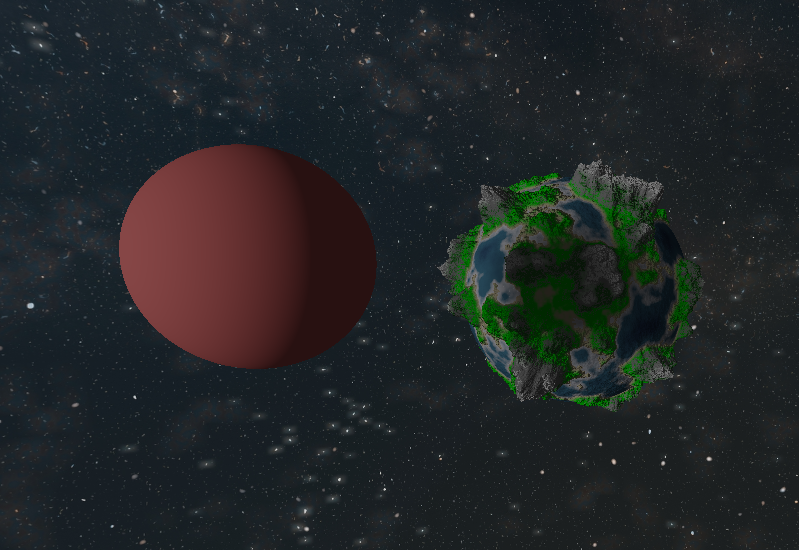 |

    *Figure 8: Comparison of eclipse settings.*

    *Note:* Stars can eclipse each other in binary star systems, so do not be surprised if a star does not light an object when another star passes in front of it!

    ## 6.2 Star lights (shadow mapping)

    For lighting, each star acts as a point light source. Shadows are handled using shadow mapping(`imgui: Enable Shadowmapping`) and are generated only for earths and the ship. We generate one shadow map per star and earth/ship combination. These shadow maps are only meant to capture shadows cast by an object onto itself, so the shadow map frustum is tightly fitted around the object. This is done by computing a bounding orthographic projection around the object in the light's view space, and using this to set the near and far planes of the shadow map frustum.

    | Shadowmapping Off Earth | Shadowmapping On Earth | Shadowmapping Off Ship | Shadowmapping On Ship |
    |:----------------:|:-------------------:|:-----------------:|:-----------------:|
    | 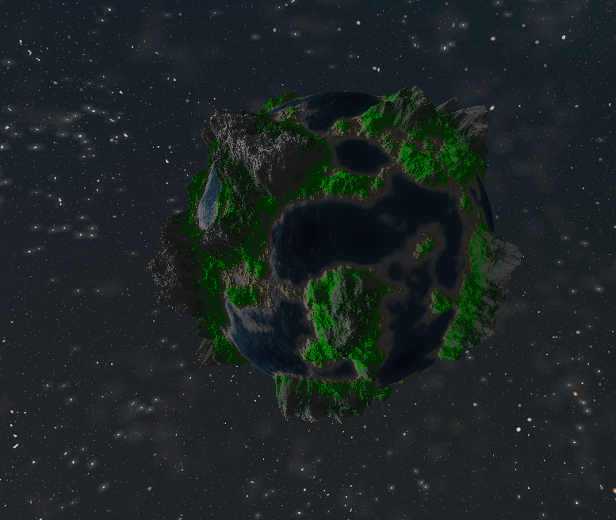 | 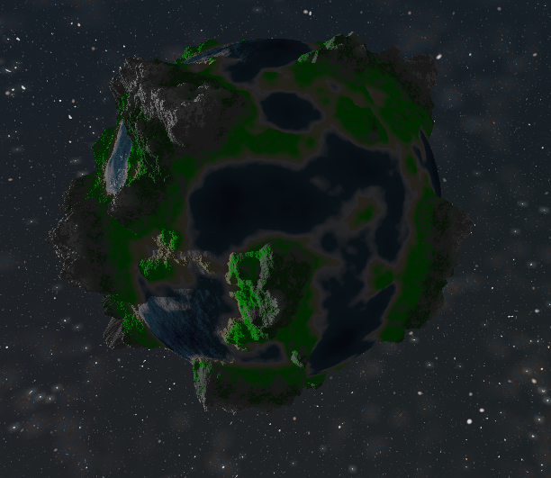  | 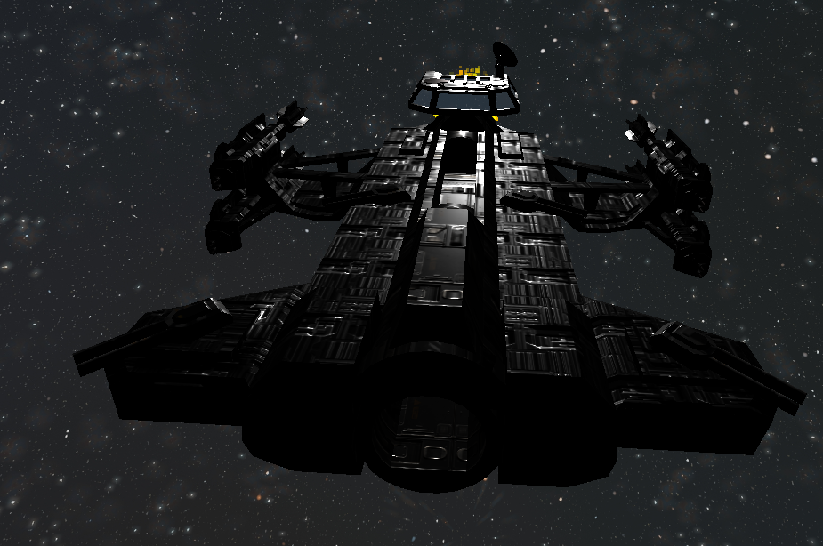 | 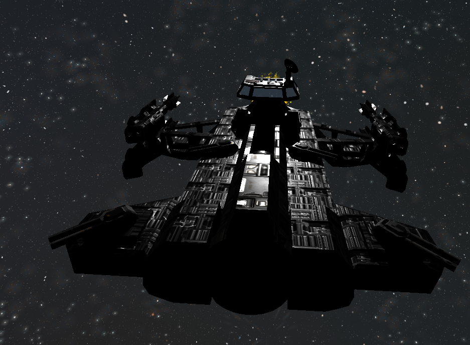 |

    Figure 9: Comparison of shadowmapping settings on earth and ship.

    The sampling of the shadow map is done using Percentage Closer Filtering (PCF) to smooth out the shadows(`imgui: PCF Kernel Radius`, `imgui:Enable PCF`).

## 6.3 Cellestial Body Shading

The earths' surface and default bodies use lambertian diffuse shading. The earths' water uses blinn-phong shading for the specular component.

## 6.4 Light Combination Battlecruiser
When multiple stars are present in the scene, their light contributions are combined additively. Each star's illumination is calculated independently, taking into account its unique color, intensity, shadow, and any eclipses affecting it. This is multiplied by an exposure factor. The final color at each fragment is the sum of the contributions from one or two stars, allowing for realistic lighting effects in binary-star systems.

## 6.5 Light Combination / tone mapping Celestial Bodies
For celestial bodies, we do a similar approach to the ship, but we also apply tone mapping and gamma correction. These values are hardcoded for celestial bodies, in order to avoid overexposure.

## 6.6 PBR Shaders (Explained in section 4.4)

# 7. Cameras

All of the rendering features described in the previous chapters, from PBR shading to particle, movement and planet systems, are meaningful only when they can be observed interactively. For this reason, special emphasis has been placed on the camera systems of this project.

Three camera types have been implemented to provide multiple perspectives for visualization and debugging:
1. A **Free Camera**, offering unrestricted exploration of the scene.
2. A **Camera Following the Battlecruiser**, dynamically tracking the spacecraft during flight. 
3. A **Minimap Camera**, rendered onto a 2D quad in the lower-right corner of the screen, providing a real-time top-down view of the environment. 

These camera modes collectively allow the user to observe the project's visual systems (lighting, materials, and animation) from various angles, enhancing both usability and presentation.

## 7.1 Free Camera

The **Free Camera** represents the most straightforward camera mode and can be toggled by pressing the `1 ` key. As the name suggests, this camera is not bound to any object. It allows the user to freely navigate the scene (moving in all directions and rotating the view using both keyboard and mouse input).
This functionality is especially useful for inspecting models, environments, and shaders from arbitrary positions, much like a first-person exploration mode (Figure 17).

<figure>
  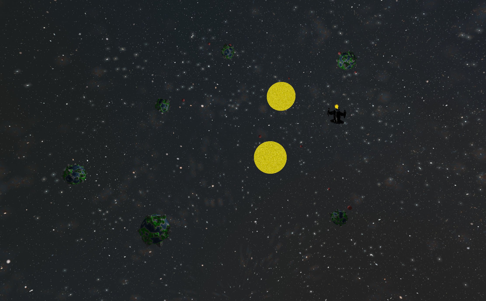
  <figcaption style="text-align:center;">Figure 17. Display of the entire project using free camera</figcaption>
</figure>  

### 7.1.1 Implementation Overview

The implementation resides in the `FreeCamera` class, which inherits from the abstract `Camera` interface.
This class provides a fully interactive camera system with six degrees of freedom, combining keyboard-based translation and mouse-based rotation.

The camera's spatial state is defined by three key vectors:
- `position`: the camera's location in world space
- `forward`: the normalized direction in which the camera is facing
- `up`: the camera's vertical orientation reference

The view matrix is constructed using the standard `glm::lookAt()` function:

```c++
glm::mat4 view = glm::lookAt(position, position + forward, up);
```

This matrix transforms world-space coordinates into the camera's local view space and is later passed as a uniform to the rendering shaders.

### 7.1.2 Input and Navigation Logic

User input is handled within the method `update_input()`, which processes both keyboard and mouse actions.

There are several keyboard controls:
- **W / S**: Move the camera forward and backward along its local forward vector
- **A / D**: Strafe left and right along the local right vector (`glm::cross(forward, up)`)
- **R / F**: Move vertically up or down along the up vector

The movement is scaled by a configurable movement speed, defined in the project's configuration file and adjustable at runtime.

When the left mouse button is pressed, the camera enters rotation mode.
Mouse deltas are converted into angular changes that rotate the camera's orientation around its local axes:
- **Horizontal mouse movement (Δx)**: rotates the camera around the world's Y-axis (yaw)
- **Vertical mouse movement (Δy)**: rotates around the local X-axis (pitch)

Rotations are applied smoothly using quaternion-based transformations for numerical stability and to avoid gimbal lock. This is implemented through the private methods:
```c++
rotate_X(float angle);
rotate_Y(float angle);
```
which internally call:
```c++
glm::quat q = glm::angleAxis(angle, axis);
```
and update the forward and up vectors accordingly.

### 7.1.3 Configuration and Initialization

The constructor initializes camera parameters such as movement speed, look sensitivity, and default orientation based on configuration data provided by the `Config` object.
It also synchronizes input handling with the active window system (`Window` class), ensuring that real-time keyboard and mouse events are processed consistently.

Example initialization:
```c++
FreeCamera::FreeCamera(const Config& config, Window* window)
    : moveSpeed(config.camera.moveSpeed),
      lookSpeed(config.camera.lookSpeed),
      position(config.camera.defaultPosition),
      window(window) {}
```
This allows flexible tuning of camera responsiveness and ensures consistent behavior across various screen resolutions and frame rates.

## 7.2 Camera Following Battlecruiser

Compared to the Free Camera, which offers unrestricted exploration of the scene, the **Battlecruiser Camera** is a constrained third-person tracking camera designed to follow the position and orientation of the battlecruiser model. It can be toggled by pressing the `2` key.
This configuration allows the viewer to observe the ship's behavior (movement, lighting, and particle effects) from a stable cinematic perspective (Figure 18).

The camera maintains a fixed radius (`offset`) behind the battlecruiser and automatically updates its position to follow the ship's trajectory in real time. This provides a consistent view of the model while ensuring that the entire spacecraft remains within the frame.

<figure>
  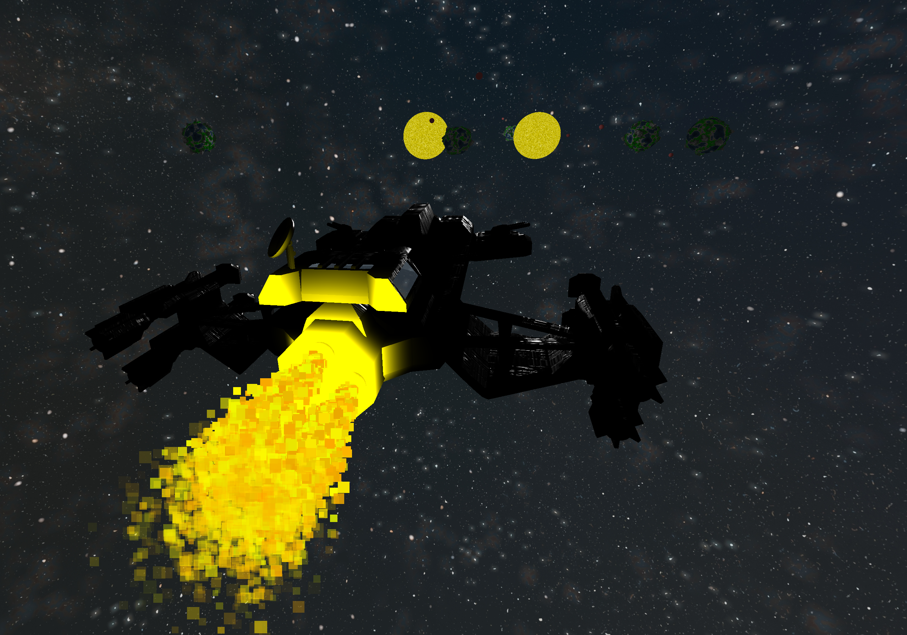
  <figcaption style="text-align:center;">Figure 18. Camera following Battlecruiser</figcaption>
</figure>  

### 7.2.1 Implementation Overview

The `BattlecruiserCamera` class inherits from the abstract `Camera` interface and references three main components:
- a `Window` instance: to handle user input.
- a `Config` object: to initialize movement and sensitivity parameters.
- a `Battlecruiser` instance: to track the ship's position and orientation.

The class continuously updates its `position`, `forward`, and `up` vectors based on the battlecruiser's world-space transform, producing a smooth and physically consistent third-person perspective.

### 7.2.2 Camera Orientation and Axes

The camera's `forward` vector is derived directly from the battlecruiser's facing direction, ensuring that the camera always looks in the same general direction as the ship.
The `up` vector is calculated using a pair of cross products that preserve alignment with the world's Y-axis:
```c++
const glm::vec3 horizontal_axis = glm::cross(Y_axis, forward);
up = glm::normalize(glm::cross(forward, horizontal_axis));
```
This construction guarantees that the camera maintains a stable vertical orientation relative to the world coordinate system, even during sharp turns or complex maneuvers.

### 7.2.3 Positioning and Tracking Logic

The camera's position is dynamically updated each frame based on the battlecruiser's world-space position (`target`) and a predefined offset distance (`offset`):
```c++
position = target - forward * offset;
```
Here:
- **target** is the battlecruiser's current world-space position, obtained from the model matrix translation component:
    ```c++
    glm::vec3 target = battlecruiser.getModelMatrix()[3];
    ```
- **offset** defines how far behind the ship the camera remains.
    Larger offsets produce a wider, more cinematic view, while smaller offsets create a more immersive "cockpit-like" perspective.

By maintaining this spatial relationship, the camera provides a continuous trailing view that reacts naturally to the ship's direction and movement.

### 7.2.4 User Interaction and Rotation Controls

While the camera automatically follows the battlecruiser, it also allows user-controlled orbiting for enhanced interactivity.
The `update_input()` method handles mouse input to rotate the camera smoothly around the ship:
- When the left mouse button is pressed, mouse movement deltas are converted into angular changes
- These angles are passed to two private rotation methods:
    ```c++
    rotate_X_around(float angle);
    rotate_Y_around(float angle);
    ```
- Both functions use quaternion-based rotations (`glm::angleAxis`) to perform smooth orbital motion around the battlecruiser.

The horizontal rotation (**yaw**) is performed around the global Y-axis, while the vertical rotation (**pitch**) is performed around the camera's local right axis.
To prevent over-rotation or flipping, the pitch is clamped within a defined range (e.g., ±80°).

This design allows the user to freely adjust the camera's viewing angle while the camera continues to track the ship's position and direction.

### 7.2.5 View Matrix Computation
Once the position and orientation vectors are updated, the view matrix is calculated using the standard GLM function:
```c++
glm::mat4 view = glm::lookAt(position, target, up);
```
This transformation aligns the camera's forward axis with the battlecruiser's orientation and ensures a stable third-person perspective.
The resulting view matrix is passed to the rendering pipeline, where it directly influences how the battlecruiser and surrounding environment are projected on-screen.

## 7.3 Minimap

To complement the free and battlecruiser-following cameras, a **minimap system** has been implemented to provide a constant top-down overview of the  (Figure 19).
This feature is particularly useful for visualizing the orbital dynamics of planets, moons, and the battlecruiser's position within the larger scene.

<figure>
  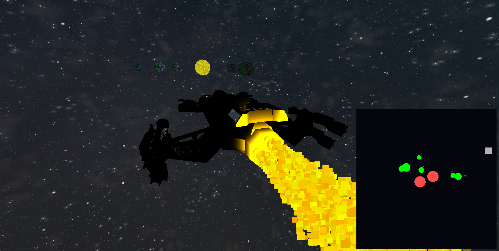
  <figcaption style="text-align:center;">Figure 19. Minimap with planets and stars (colored circles), battlecruiser (gray square) and the bezier path (white circles)</figcaption>
</figure>  

The minimap is centered around the world origin `(0, 0, 0)`, which also corresponds to the center of the solar system. Its primary purpose is to display the **current positions of celestial bodies** and the **real-time position of the battlecruiser**.
Planets and suns are represented by colored circles: suns in red, Earth-like planets in blue, and moons in yellow, and each is scaled for visual clarity. The battlecruiser is rendered as a gray square, representing the object's current location. Because the minimap is a simplified 2D projection, the ship can travel outside its visible bounds if it moves beyond the map's coordinate range.

If the **Bezier-path flight mode** (see Section 1.9.4) is enabled, the minimap also displays the sampled trajectory points of the cubic curves, represented as small white circles, allowing users to track the automated movement path at a glance.

As a 2D system, the minimap entirely ignores the world Y-axis, relying only on the X and Z coordinates to compute positions.

### 7.3.1 Implementation Overview

The minimap is implemented through the `Minimap` class, which defines a dedicated **rendering subsystem** that projects 3D world data onto a flat, top-down 2D texture.
This texture is displayed on the main screen as a small inset view (a "radar"-like overlay), positioned on the bottom right side.

1. **Off-screen rendering**:
   The minimap's content (planets, battlecruiser, and trajectory points) is rendered to an off-screen **framebuffer** texture (`minimapColorTexture`) using the shader pair `shaders/minimap_vert.glsl` and `shaders/minimap_frag.glsl`.
2. **On-screen compositing**:
   The resulting texture is drawn to a screen-aligned quad in the lower-right corner of the viewport through the method `drawToScreen()` using a second shader pair, `shaders/minimap_screen_vert.glsl` and `shaders/minimap_screen_frag.glsl`.

During initialization (`initBuffers()`), the class sets up:
- A framebuffer object (FBO) for off-screen rendering
- A color texture to store the minimap image
- A depth buffer for proper layering of objects
- Both shader programs required for map rendering and screen compositing: `minimapShader` and `minimapScreenShader`

### 7.3.2 World-to-Minimap Projection

The minimap uses an orthographic projection to flatten 3D world positions onto a 2D plane:

$$
\text{projection} = \text{glm::ortho}(x_{\min}, x_{\max}, z_{\min}, z_{\max})
$$

This projection preserves spatial relationships on the X–Z plane, ensuring that orbital distances and trajectories appear proportionally accurate in the minimap.

All scene entities (planets, moons, Bezier points, and the battlecruiser) are converted into lightweight `Object` structures using helper functions such as:
```c++
convertBodyToObjects();
convertBezierPointsToObjects();
```
Each structure stores its `position`, `radius`, and `color`, and is rendered as a small quad via `glDrawElements()`.
Uniforms such as `planetPos`, `planetColor`, and `planetScale` are passed to the minimap shader to control the visual appearance of each element.

### 7.3.3 Minimap Rendering Shader

The minimap vertex shader (`shaders/minimap_vert.glsl`) projects each object into 2D space using orthographic coordinates.
Each vertex represents a corner of a simple quad scaled and positioned according to the object's attributes:
```glsl
void main() {
    uv = position;
    vec2 pos = planetPos + position * planetScale;
    gl_Position = projection * vec4(pos, 0.0, 1.0);
}
```
Here:
- `uv` represents the quad's local texture coordinates,
- `planetPos` defines the world-space 2D position (X, Z),
- `planetScale` determines the size of the rendered marker.

The fragment shader (`shaders/minimap_frag.glsl`) controls the shape and color of each object:
```glsl
void main() {
    float dist = length(uv);

    if (isPlanet == 1) {
        if (dist > 1.0)
        discard;
    }
    else {
        if (abs(uv.x) > 1.0 || abs(uv.y) > 1.0)
        discard;
    }

    outColor = vec4(planetColor, 1.0);
}
```
This logic allows planets and trajectory points to appear as circles, while non-planetary objects (such as the battlecruiser indicator) render as squares.
The final color is assigned via the `planetColor` uniform from the C++ renderer.

### 7.3.4 On-Screen Compositing

The screen-space shader pair (`shaders/minimap_screen_vert.glsl` and `shaders/minimap_screen_frag.glsl`) is responsible for displaying the generated minimap texture on the main window.

The vertex shader simply passes texture coordinates to the fragment stage:
```glsl
void main()
{
    fragUV = texCoords;
    gl_Position = vec4(position, 0.0, 1.0);
}
```

The fragment shader samples from the minimap texture and outputs the final color to the screen:
```glsl
void main()
{
    vec4 texColor = texture(minimapTex, fragUV);
    outColor = texColor;
}
```
This rendering step maps the off-screen minimap texture onto a 2D quad placed in the bottom-right corner of the viewport, creating a non-intrusive visual overlay that updates in real time.


# 8. Skybox

With the planetary system and battlecruiser fully functional, one final element is required to give the simulation a sense of scale and depth: the **skybox**.
Without it, the universe would appear as an empty void, lacking any distant visual context (Figure 20).

<figure>
  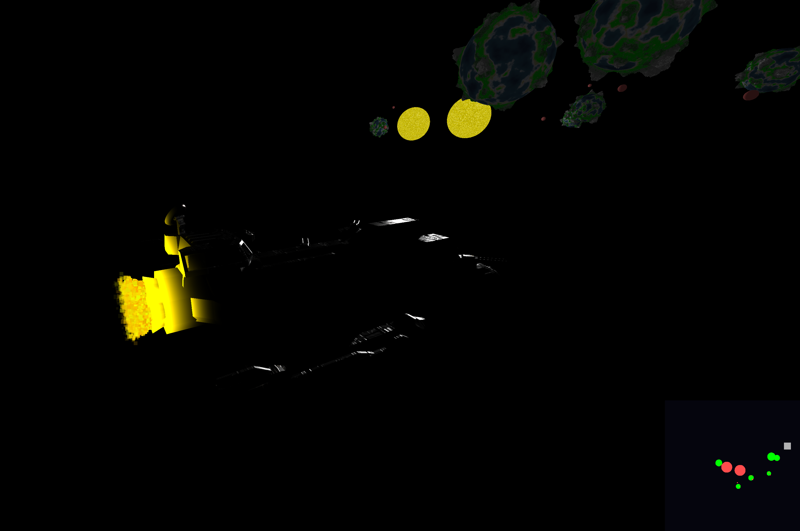
  <figcaption style="text-align:center;">Figure 20. Scene without skybox</figcaption>
</figure>  

A skybox provides both **aesthetic** and **functional** benefits:
- It visually encloses the entire scene, adding immersion and realism (Figure 21).
- It provides the **environment map** used for reflection sampling in the shader of the battlecruiser (see Section 1.6).

<figure>
  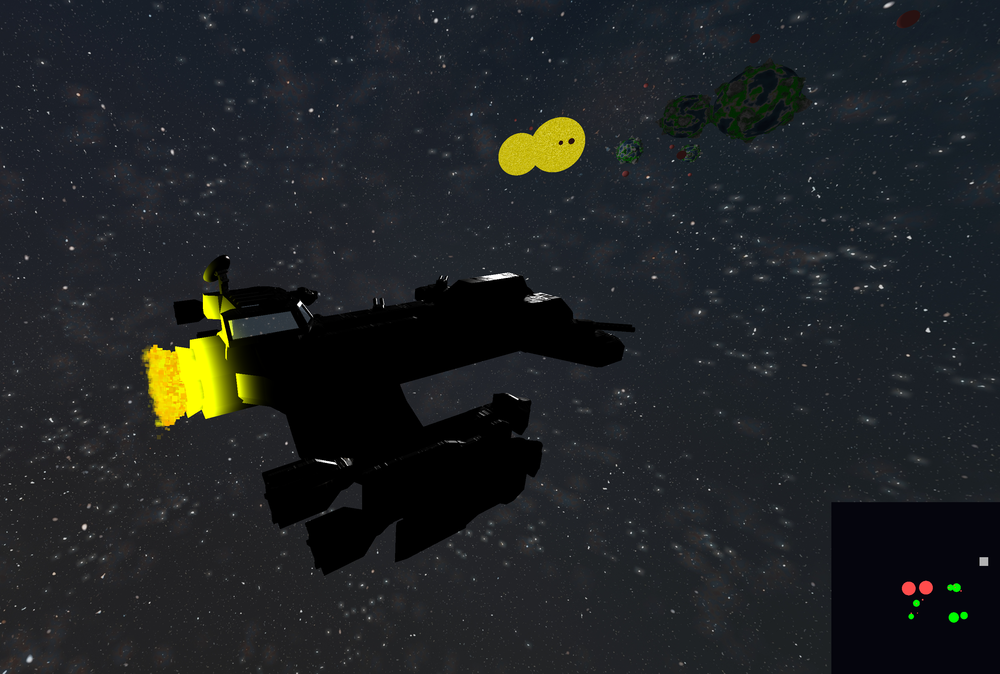
  <figcaption style="text-align:center;">Figure 21. Scene with skybox</figcaption>
</figure>  

In the rendering pipeline, the skybox is the first object drawn each frame.
Because it should appear infinitely distant, it never moves relative to the camera's position and is not affected by translation, only by the camera's rotation.
All other scene elements (planets, ships, and particles) are rendered on top of it.

The entire system is implemented within the `Skybox` class, which encapsulates loading, geometry setup, and rendering of a cubemap texture that forms the scene's background.

## 8.1 Overview and Responsibilities

At a high level, the Skybox class handles three major tasks:
1. **Cubemap loading**: importing six images that represent the faces of a cube.
2. **GPU setup**: preparing the cube geometry (VAO, VBO, IBO) and compiling the associated shaders.
3. **Rendering**: drawing the cube using cubemap sampling and special depth handling to make it appear infinitely far away.

Each step contributes to a self-contained OpenGL subsystem that provides a visually convincing background environment.

## 8.2 Cubemap Loading

The private loader function `loadCubemap(const std::vector<std::string>& faces)` loads the six cubemap textures corresponding to the six faces of a cube:
| Face Index | Cubemap Target                   | Description |
| ---------- | -------------------------------- | ----------- |
| 0          | `GL_TEXTURE_CUBE_MAP_POSITIVE_X` | Right face  |
| 1          | `GL_TEXTURE_CUBE_MAP_NEGATIVE_X` | Left face   |
| 2          | `GL_TEXTURE_CUBE_MAP_POSITIVE_Y` | Top face    |
| 3          | `GL_TEXTURE_CUBE_MAP_NEGATIVE_Y` | Bottom face |
| 4          | `GL_TEXTURE_CUBE_MAP_POSITIVE_Z` | Front face  |
| 5          | `GL_TEXTURE_CUBE_MAP_NEGATIVE_Z` | Back face   |

Each image is read from disk using the STB Image library (`stbi_load`), then uploaded to its corresponding cubemap target:
```c++
for (unsigned int i = 0; i < faces.size(); i++) {
    stbi_uc* data = stbi_load(faces[i].c_str(), &width, &height, &nrChannels, 3);
    glTexImage2D(GL_TEXTURE_CUBE_MAP_POSITIVE_X + i, ... , data);
}
```

Texture parameters are set for linear filtering and clamping to the cube's edges to ensure seamless transitions between faces. The resulting cubemap will be used later by the fragment shader for directional texture sampling during rendering. 

Two static arrays define the skybox’s geometry:
- `skyboxVertices`: 3D positions for the cube’s eight corners (24 floats).
- `skyboxIndices`: 36 indices defining the cube’s 12 triangles.

These buffers are uploaded once in the constructor and reused each frame for rendering.

## 8.3 Rendering

The draw method `draw(glm::mat4 view, glm::mat4 projection)` handles the runtime rendering of the skybox each frame.

First, the depth behavior is adjusted:

```c++
glDepthFunc(GL_LEQUAL);
glDepthMask(GL_FALSE);
```

The skybox should not occlude scene geometry, so depth writing is disabled, and the depth comparison function allows fragments at the farthest depth to pass.

Secondly, the shader is binded and the `mvp` (model-view-projection matrix) is computed. The translation component is removed from the camera's view matrix:

```c++
glm::mat4 skyboxMVP = projection * glm::mat4(glm::mat3(view));
```

This ensures that the skybox rotates with the camera but never translates, appearing infinitely far away.

Afterwards, the cubemap texture is passed into the shader, and the geometry is drawn:

```c++
glBindTexture(GL_TEXTURE_CUBE_MAP, _cubemapTexture);
glDrawElements(GL_TRIANGLES, 36, GL_UNSIGNED_INT, 0);
```

As a result, a cube is rendered around the camera using the cubemap texture, producing a continuous 360° background.

The skybox rendering pipeline is represented by the following table:

| Step  | Responsibility                                      | Core Function / Section |
|-------|-----------------------------------------------------|-------------------------|
| **1** | Load six texture faces into cubemap                 | `loadCubemap()`         |
| **2** | Build GPU buffers for cube geometry                 | `Skybox()` constructor  |
| **3** | Compile and link skybox shader                      | `Skybox()` constructor  |
| **4** | Render cube with cubemap sampling and depth control | `draw()`                |
| **5** | Clean up GPU resources                              | `~Skybox()`             |


## 8.4 Shader Overview

The skybox uses a pair of lightweight shaders: a vertex and a fragment shader (`shaders/skybox_vert.glsl` and `shaders/skybox_frag.glsl`), that work together to render the cubemap environment efficiently.
Their main role is to project a cube around the camera and sample the appropriate texture color from the cubemap based on viewing direction.

The vertex shader transforms each cube vertex using the model–view–projection (MVP) matrix derived earlier, such that the skybox rotates with the camera but never moves with it.
Each vertex `position` is also used as a direction vector for texture sampling.

By forcing the depth output with:
```glsl
gl_Position = pos.xyww;
```
the cube is always drawn at the farthest depth, guaranteeing that it remains behind all scene geometry.

The fragment shader performs a single cubemap lookup using the interpolated direction from the vertex stage:
```glsl
color = texture(skybox, texCoords);
```

This simple operation retrieves the correct section of the environment image corresponding to the viewer's orientation, producing a continuous, seamless panoramic background.
Together, these shaders form an extremely efficient rendering stage that visually encloses the entire scene and provides the base for reflection sampling in the battlecruiser's PBR shader.

# 9. Summary
This assignment demonstrates the integration of advanced 3D graphics techniques in OpenGL, including PBR shading, shadow mapping, procedural terrain, particle systems, and dynamic camera controls. The battlecruiser and solar system modules showcase both technical and artistic workflows, from CAD modeling to real-time rendering. Features such as eclipses, animated textures, and hierarchical transformations contribute to a visually rich and interactive simulation. The project highlights effective collaboration, modular design, and the practical application of modern graphics algorithms.
